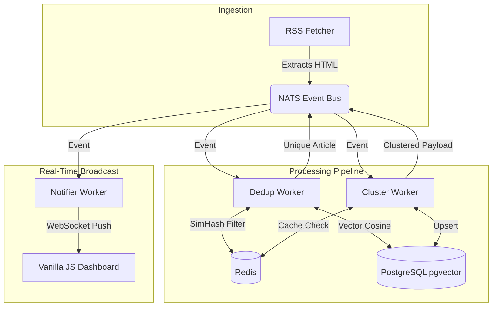

# VyomaCast

**VyomaCast is a real-time, event-driven news clustering engine.** It autonomously ingests RSS feeds, deduplicates syndicated content using a two-stage lexical and semantic pipeline, and broadcasts clustered storylines to a real-time WebSocket dashboard.

## Why "VyomaCast"?

**Vyoma** (व्योम) is a Sanskrit word translating to *sky*, *space*, or *the boundless expanse*. **Cast** represents the real-time transmission and broadcasting of data. 

In the modern digital age, raw information is chaotic and limitless. 
**VyomaCast** embodies the system's core architectural mission: capturing data from the vast, unstructured universe of global news, structurally clustering it, and streaming it into a clear, intelligent, and unified real-time broadcast.


---

## 🏗 System Architecture

VyomaCast uses a decoupled, event-driven pipeline where all components communicate asynchronously via NATS JetStream.



---

## ⚡ Core Tech Stack

* **Backend & API:** Python 3.12, FastAPI, Pydantic V2
* **Event Backbone:** NATS JetStream (Exactly-once, durable delivery)
* **Hot-State Cache:** Redis 7 (SimHash sliding windows, circuit breakers)
* **Cold Storage & AI:** PostgreSQL 16 + `pgvector` (HNSW indexing, SQLAlchemy 2.0)
* **Frontend UI:** Zero-dependency Vanilla JS & CSS (XSS-safe, 60fps DOM manipulation)
* **Machine Learning:** `sentence-transformers` (all-MiniLM-L6-v2) for 384-dim semantic embeddings

---

## ✨ Key Features

* **Two-Stage Deduplication:** A highly optimized pipeline that first runs a 128-bit SimHash (lexical check) against Redis, discarding 70% of duplicates in <1ms. Surviving articles undergo a precise vector cosine similarity check against Postgres.
* **Event-Driven Resilience:** Built entirely on asynchronous workers subscribing to NATS. Includes strict `ACK`/`NAK`/`TERM` semantics, meaning no pipeline blockages, infinite retries, or poison pills.
* **Optimistic Concurrency:** Relies on version-guarded `ON CONFLICT` database upserts instead of distributed locks, allowing limitless horizontal worker scaling.
* **Real-Time DOM, Zero React:** The frontend dashboard connects via WebSockets and manipulates the DOM surgically. By leveraging normalized memory maps and `document.createElement`, it handles high-throughput cluster updates at 60fps without heavy frameworks.

---

## 🚀 Local Quickstart

Follow these steps to spin up the entire event-driven architecture locally.

### 1. Start Infrastructure
Boot up the custom-configured PostgreSQL, Redis, and NATS containers:
```bash
docker compose up -d
```
*Wait ~10 seconds for databases to initialize, then verify health:*
```bash
python scripts/check_infra.py
```

### 2. Configure Environment & NATS
Copy the environment template and initialize the NATS JetStream topics:
```bash
copy .env.example .env
python scripts/setup_nats.py
```

### 3. Run Database Migrations
Initialize the `pgvector` extension and schema tables:
```bash
alembic upgrade head
```

### 4. Start the Workers & API
Open multiple terminal windows (or use a process manager like `honcho`):
```bash
# Start the API & WebSocket server
uvicorn src.api.main:app --host 0.0.0.0 --port 8000

# Start the pipeline workers
python -m src.workers.dedup_worker
python -m src.workers.cluster_worker
python -m src.workers.notifier_worker
python -m src.workers.feed_manager
```

### 5. Open the Dashboard
Simply serve the static dashboard directory:
```bash
python -m http.server -d dashboard 8080
```
Navigate to `http://localhost:8080` to watch clusters form in real-time as the feed manager pulls data.

---

## 🛣 Roadmap (Phase 2- UpComing)

With the foundational pipeline and data integrity locked in, Phase 2 will introduce AI-native consumption features:

* **Local LLM Summarization:** Auto-generating concise, unbiased summaries for active story clusters as they evolve.
* **LiveKit WebRTC Voice Agents:** Connecting VyomaCast to interactive, conversational AI agents allowing users to "talk" to the news stream in real-time.

---

## 📄 License

This project is licensed under the **GNU Affero General Public License v3.0 (AGPL-3.0)**.

> [!WARNING]
> Commercial use, proprietary modifications, or hosting this software as a commercial cloud service requires a commercial license. For licensing inquiries, please contact the author.

