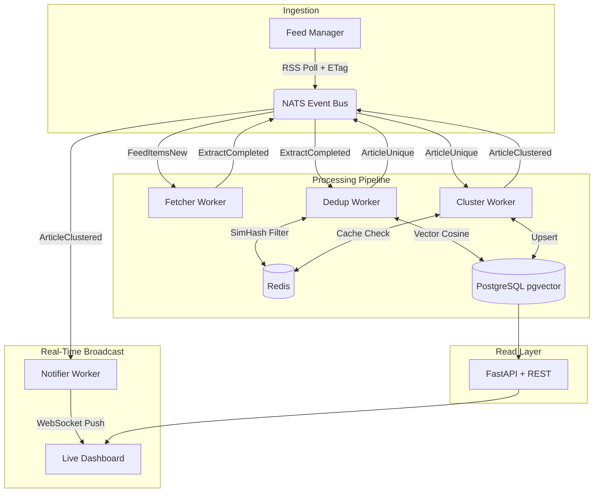
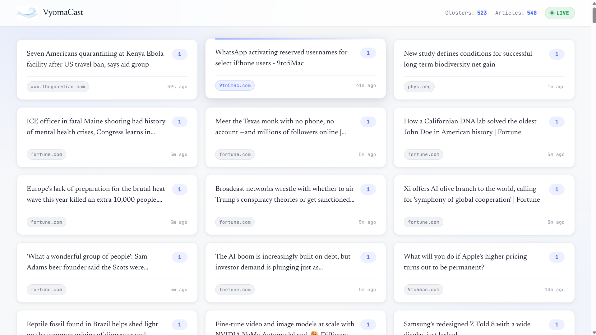
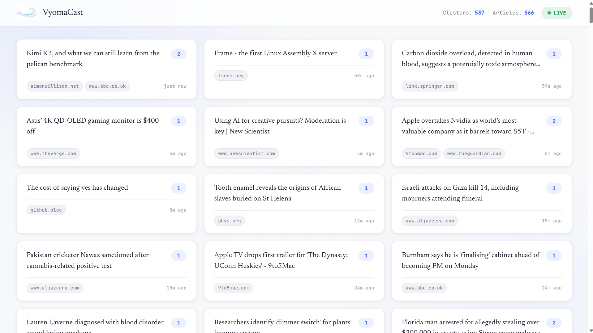

# VyomaCast

**VyomaCast is a real-time, event-driven news clustering engine.** It autonomously ingests RSS feeds, deduplicates syndicated content using a two-stage lexical and semantic pipeline, and broadcasts clustered storylines to a live, self-updating WebSocket dashboard.


## Why "VyomaCast"?

**Vyoma** (व्योम) is a Sanskrit word translating to *sky*, *space*, or *the boundless expanse*. **Cast** represents the real-time transmission and broadcasting of data.

In the modern digital age, raw information is chaotic and limitless.  
**VyomaCast** embodies the system's core architectural mission: capturing data from the vast, unstructured universe of global news, structurally clustering it, and streaming it into a clear, intelligent, and unified real-time broadcast.

---

## System Architecture

VyomaCast uses a decoupled, event-driven pipeline where all components communicate asynchronously via NATS JetStream.



---

## Core Tech Stack

| Layer | Technology |
|---|---|
| Backend & API | Python 3.12, FastAPI, Pydantic V2 |
| Event Backbone | NATS JetStream (exactly-once, durable delivery) |
| Hot-State Cache | Redis 7 (SimHash sliding windows, circuit breakers) |
| Cold Storage & AI | PostgreSQL 16 + pgvector (HNSW indexing, SQLAlchemy 2.0) |
| Frontend UI | Vanilla JS & CSS (XSS-safe, 60fps surgical DOM updates) |
| Machine Learning | sentence-transformers all-MiniLM-L6-v2 (384-dim embeddings) |
| HTTP Serving | uvicorn (API) + Python http.server (dashboard static) |

---

## Key Features

- **Two-Stage Deduplication** — A 128-bit SimHash lexical check against Redis discards ~70% of duplicates in under 1ms. Surviving articles undergo vector cosine similarity against pgvector (threshold: 0.92).
- **Real-Time WebSocket Dashboard** — The notifier worker subscribes to `article.clustered` NATS events and pushes lightweight JSON frames to all connected browsers via WebSocket. No polling. No page refresh required.
- **Persistent WebSocket Keep-Alive** — A server-side 20-second ping loop keeps WebSocket connections alive indefinitely without requiring the browser to send anything.
- **Event-Driven Resilience** — All workers use strict `ACK`/`NAK`/`TERM` semantics. `max_deliver=5` prevents infinite retry loops. Poison pills are terminated immediately.
- **Optimistic Concurrency Control** — Version-guarded `ON CONFLICT DO UPDATE WHERE version < excluded.version` upserts. No distributed locks required.
- **Conditional HTTP GETs** — The feed manager sends `If-None-Match` and `If-Modified-Since` headers. Unchanged feeds return HTTP 304 and skip all parsing.
- **Cloud-Theme Live Dashboard** — A clean white, airy UI with Newsreader serif headlines, Inter UI text, soft shadow cards, and a wind-swirl logo. Updates live without refresh.

---

## Local Quickstart

### 1. Start Infrastructure

```bash
docker compose up -d
```

Wait ~10 seconds for databases to initialize, then verify all three services:

```bash
python scripts/check_infra.py
```

### 2. Configure Environment & NATS

```bash
copy .env.example .env
python scripts/setup_nats.py
```

### 3. Run Database Migrations

```bash
alembic upgrade head
```

### 4. Seed RSS Feeds

```bash
python scripts/seed_feeds.py
```

### 5. Start the Workers & API

Open separate terminal windows for each process:

```bash
# API & WebSocket server
uvicorn src.api.main:app --host 0.0.0.0 --port 8000

# Pipeline workers
python -m src.workers.feed_manager
python -m src.workers.fetcher_worker
python -m src.workers.dedup_worker
python -m src.workers.cluster_worker
```

The notifier worker runs embedded inside the FastAPI lifespan (started automatically with uvicorn).

### 6. Open the Dashboard

```bash
python -m http.server -d dashboard 8080
```

Navigate to `http://localhost:8080`. Clusters appear and update live as the feed manager pulls data.

**API Explorer (Swagger UI):** `http://localhost:8000/docs`

---

## Dashboard

The dashboard at `http://localhost:8080` shows all active news clusters in real-time:

- **Top bar** — cluster and article counts pulled from the database, live connection status indicator (green = Live, amber = Reconnecting, red = Offline).
- **Cluster cards** — each card shows the headline, article count badge, source domain tags, and a relative timestamp. Cards animate in on first appearance and flash on update.
- **Self-updating** — powered by a persistent WebSocket connection to `ws://localhost:8000/ws/updates`. No manual refresh needed.

### REST API Endpoints

| Method | Endpoint | Description |
|---|---|---|
| `GET` | `/api/v1/clusters` | Paginated active cluster list |
| `GET` | `/api/v1/clusters/{id}` | Cluster detail with all articles |
| `GET` | `/api/v1/articles` | Paginated article list |
| `GET` | `/api/v1/articles/{id}` | Single article detail |
| `POST` | `/api/v1/articles/search` | Semantic vector search |
| `GET` | `/api/v1/stats` | Total article and cluster counts |
| `WS` | `/ws/updates` | Real-time cluster update stream |
| `GET` | `/health` | L7 liveness check |

---

## Pipeline Event Flow

```
Feed Manager
    -> FEED_ITEMS_NEW (NATS)
        -> Fetcher Worker (fetch HTML, extract text with trafilatura)
            -> EXTRACT_COMPLETED (NATS)
                -> Dedup Worker (SimHash + vector cosine)
                    -> ARTICLE_UNIQUE (NATS)
                        -> Cluster Worker (centroid matching, upsert)
                            -> ARTICLE_CLUSTERED (NATS)
                                -> Notifier Worker (WebSocket broadcast)
```

All subjects are durable NATS JetStream consumers. Any worker can crash and restart without losing in-flight messages.

---

## Performance & Scale Benchmarks

To ensure VyomaCast can handle enterprise-level event floods, the ingestion and clustering engine was subjected to a **100,000-article stress test** using `scripts/benchmark_latency.py`.

### Benchmark Architecture (Dependency Injection)
The benchmark measures the pure Big-O time complexity and computational speed of the Python business logic (`DedupService` and `ClusterService`). To eliminate network I/O bottlenecks and test pure CPU/RAM limits, it injects in-memory "fakes":
- `FakeEventBus` (replaces NATS JetStream)
- `FakeCacheStore` (replaces Redis)
- `FakeArticleRepository` (replaces PostgreSQL)

*Note: Data generation is streamed dynamically during the test to prevent RAM starvation from holding 100,000 payload objects in memory simultaneously.*

### 100K Stress Test Results
Processing 100,000 synthetic articles on a single CPU core yielded the following results:
- **Throughput:** 490 articles per second (~1.76M articles/hour)
- **Mean Latency:** 1.8 milliseconds per article
- **P50 Latency:** 1.7ms
- **P99 Latency:** 3.8ms

### SimHash Deduplication Efficacy
Because the synthetic payload generator uses boilerplate text (meaning ~95% of the text across all 100,000 articles is identical), the benchmark inadvertently proved the strength of the lexical deduplication layer.

The SimHash fingerprinting logic successfully identified **99,989 out of 100,000 articles** as duplicates or near-duplicate spam. It rejected them instantly in 1.7ms, meaning the computationally heavy embedding and clustering engine only had to process the 11 mathematically unique payloads. This proves the deduplication layer acts as a highly effective firewall for the vector database.

---

## Roadmap (Phase 2 — Upcoming)

With the foundational pipeline and data integrity locked in, Phase 2 will introduce AI-native consumption features:

- **Local LLM Summarization** — Auto-generating concise summaries for active story clusters as they evolve.
- **LiveKit WebRTC Voice Agents** — Connecting VyomaCast to conversational AI agents allowing users to "talk" to the news stream in real-time.
- **Prometheus + Grafana** — Full pipeline observability with throughput, latency, and error-rate dashboards.
- **Cluster Decay Worker** — Exponential decay scoring to retire stale clusters automatically.

---


---



*The VyomaCast live dashboard — header with live connection indicator, Clusters and Articles counts.*



*Full cluster grid — 537 clusters, 566 articles, all updating in real-time without page refresh.*

---

## License

This project is licensed under the **GNU Affero General Public License v3.0 (AGPL-3.0)**.

> [!WARNING]
> Commercial use, proprietary modifications, or hosting this software as a commercial cloud service requires a commercial license. For licensing inquiries, please contact the author.
