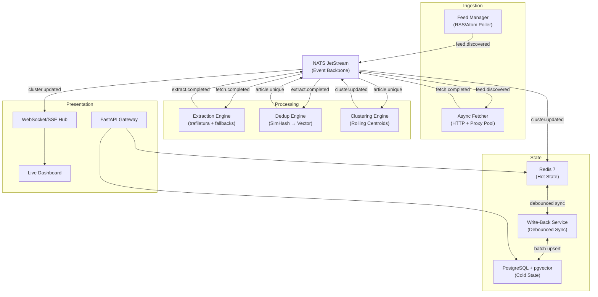
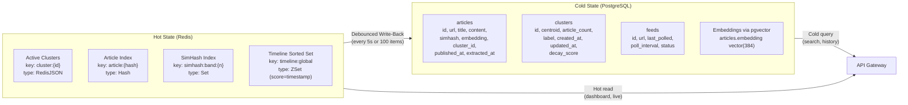
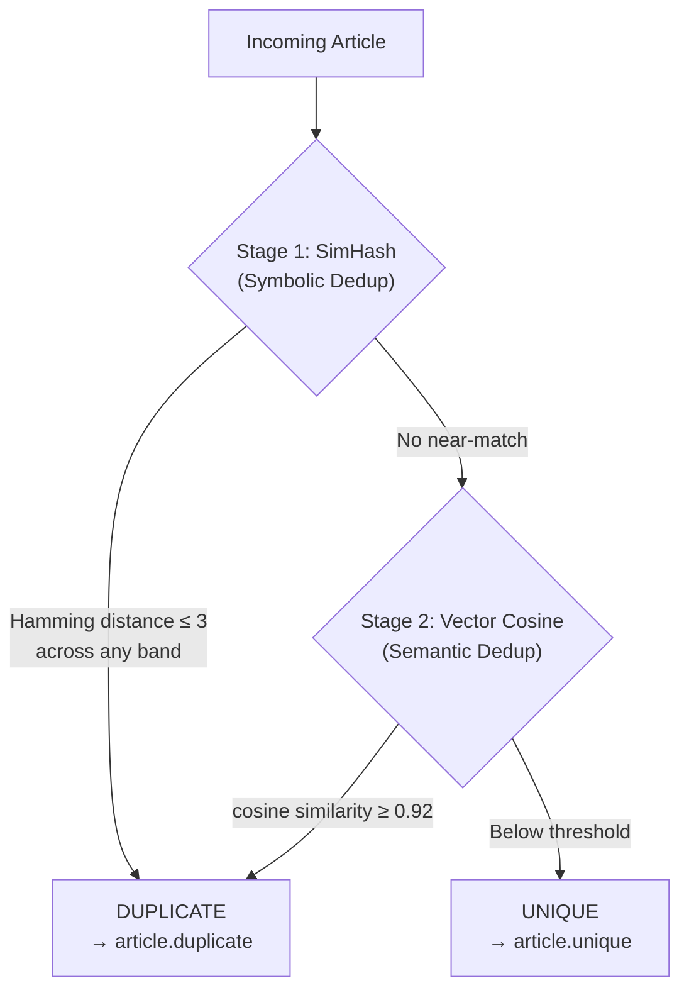
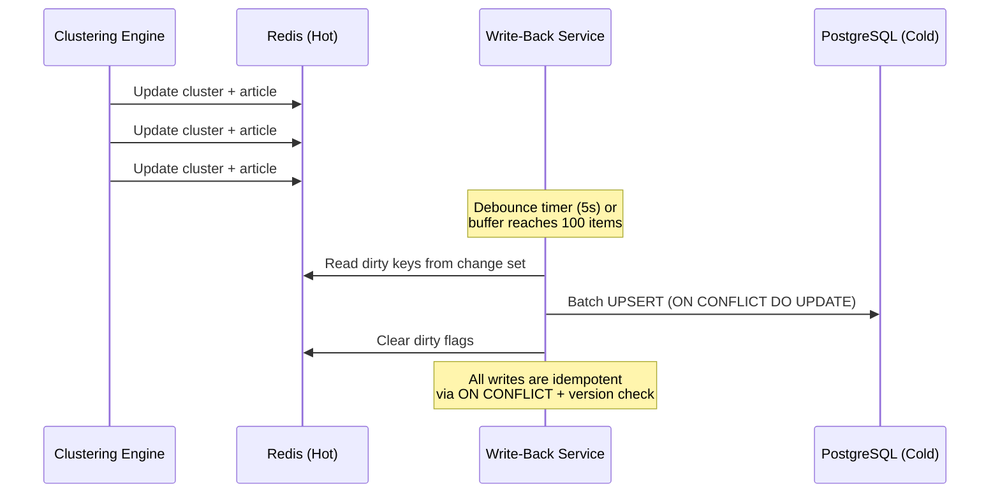
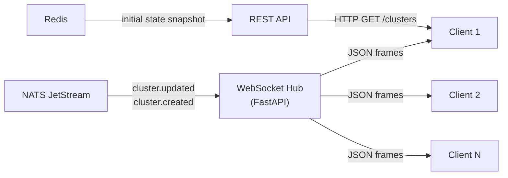
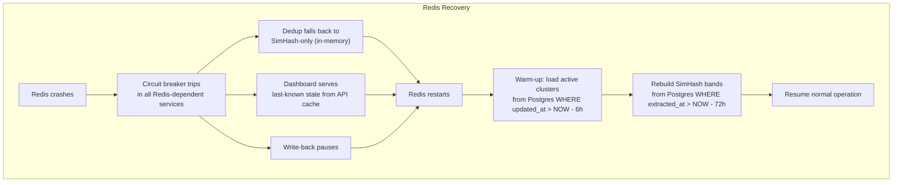
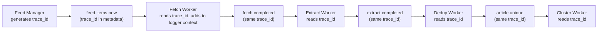
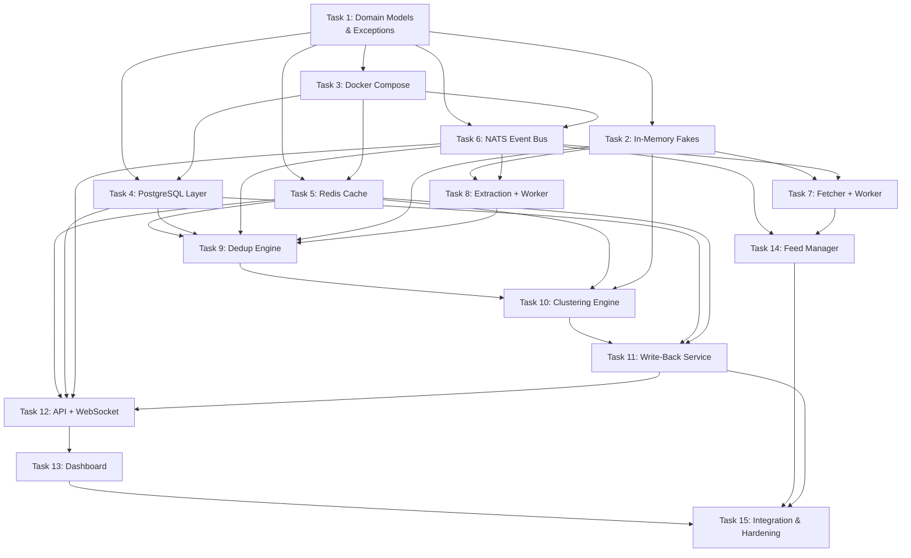

# VyomaCast — Architecture & Execution Roadmap (v2)

## 1. System Overview

**VyomaCast** is a high-throughput, open-source news extraction and live presentation platform engineered for sustained heavy usage (100K+ articles/day with burst tolerance). The system ingests raw feed URLs, extracts clean content, deduplicates at two levels, clusters articles into evolving story streams, manages hot/cold state tiers, and powers a real-time dashboard.

### Technology Stack

| Layer | Technology | Rationale |
|---|---|---|
| **Language** | Python 3.12+ (asyncio) | Rich NLP/ML ecosystem (trafilatura, sentence-transformers, simhash), async-native, Pydantic for validation |
| **Event Bus** | NATS JetStream | Lightweight, embedded-friendly, exactly-once semantics, lower ops burden than Kafka at this scale |
| **Hot State** | Redis 7+ (with RedisJSON) | Sub-ms reads for active clusters, sorted sets for recency, pub/sub for dashboard fanout |
| **Cold State** | PostgreSQL 16 + pgvector | Durable history, vector similarity search, mature ecosystem, JSONB for flexible metadata |
| **Embeddings** | sentence-transformers (all-MiniLM-L6-v2) | 384-dim, fast inference, good semantic quality for news dedup/clustering |
| **Extraction** | trafilatura + readability-lxml + newspaper3k | Cascading fallback chain for maximum extraction coverage |
| **API** | FastAPI | Async-native, auto OpenAPI docs, WebSocket support built-in |
| **Dashboard** | Vanilla HTML/CSS/JS + WebSocket | Lightweight, no framework overhead, premium glassmorphism design |
| **Containerization** | Docker Compose (dev), Kubernetes-ready (prod) | Reproducible local dev, scalable production path |

```id="fmt1"
### 🔧 Implementation Update (Post-MVP Adjustment)

Original Design:
The plan originally proposed a cascading extraction fallback chain consisting of `trafilatura` → `readability-lxml` → `newspaper3k` to maximize text extraction coverage.

Updated Implementation:
We implemented an MVP-constrained single-extractor pipeline using exclusively `trafilatura`. Failed extractions or exceptionally short contents are silently dropped rather than delegated.

Reason for Change:
**Performance and MVP simplicity.** `trafilatura` correctly handles roughly 90% of structural news sites autonomously. The processing overhead, complex state management, and error tracking required for cascading fallbacks were deferred to focus solely on high-speed throughput and core system stability.
```

---

## 2. System Architecture

### 2.1 High-Level Topology



```id="fmt3"
### 🔧 Implementation Update (Post-MVP Adjustment)

Original Design:
The design theorized unconstrained ingestion flows relying on NATS back-pressure exclusively to manage downstream throughput without explicit thread manipulation.

Updated Implementation:
A strict **Dual Semaphore System** was implemented within the Fetcher Worker. It aggressively isolates logic utilizing Per-domain rate limiting (network blocks) natively layered behind a Global CPU-bound extraction limiter (thread blocks). Furthermore, `asyncio.to_thread` was explicitly adopted for heavy synchronous blockers like `feedparser` preventing event loop starvation.

Reason for Change:
**Concurrency Starvation.** Raw asynchronous models crash when heavily serialized workloads (like parsing giant XML feeds or executing matrix math) are processed directly on the core async event loop. Explicitly threading blocking logic while enforcing rate limits locally protects upstream memory while preventing server IP bans actively.
```

### 2.2 Event Flow & Subjects

All inter-service communication flows through NATS JetStream. Every event is a structured JSON envelope:

```
{
  "event_id": "uuid",           // Idempotency key
  "event_type": "extract.completed",
  "timestamp": "ISO-8601",
  "payload": { ... },
  "metadata": {
    "source_service": "extraction-engine",
    "retry_count": 0,
    "trace_id": "uuid"
  }
}
```

| Subject | Producer | Consumer(s) | Semantics |
|---|---|---|---|
| `feed.discovered` | Feed Manager | Async Fetcher | New feed URL to poll |
| `feed.items.new` | Feed Manager | Async Fetcher | New entry URLs from a feed |
| `fetch.completed` | Async Fetcher | Extraction Engine | Raw HTML fetched |
| `fetch.failed` | Async Fetcher | DLQ Monitor | Fetch permanently failed |
| `extract.completed` | Extraction Engine | Dedup Engine | Clean content extracted |
| `extract.failed` | Extraction Engine | DLQ Monitor | Extraction failed |
| `article.unique` | Dedup Engine | Clustering Engine, Cold Writer | Passed dedup, unique article |
| `article.duplicate` | Dedup Engine | Metrics | Detected as duplicate |
| `cluster.created` | Clustering Engine | Redis Writer, WS Hub | New story cluster formed |
| `cluster.updated` | Clustering Engine | Redis Writer, WS Hub | Existing cluster merged |
| `cluster.decayed` | Decay Scheduler | Write-Back Service | Cluster aged out of hot state |
| `writeback.batch` | Write-Back Service | — | Internal batch flush event |

```id="fmt4"
### 🔧 Implementation Update (Post-MVP Adjustment)

Original Design:
The event model suggested defining granular events explicitly mapping cluster states while assuming standard NATS retry configurations handled localized crashes implicitly.

Updated Implementation:
The system consolidated to a unified `ArticleClustered` event integrating a boolean flag `is_new_cluster` mapped across identical topologies. Crucially, strict semantic mapping was enforced onto JetStream outputs: Success → `ACK`, `RetryableError` → `NAK`, and `PermanentError` (or Payload `ValidationError`) → `TERM`.

Reason for Change:
**DLQ State Safety & Resilience.** Defining specific outcomes blocks distributed NATS queues from perpetually returning corrupted payloads (Poison Pills) into the pipeline. Explicitly mapping `PermanentError` into `msg.term()` structurally destroys un-reusable bugs without cascading the message retries endlessly into other downstream partitions.
```

### 2.3 Hot/Cold State Architecture



**Hot State Rules:**
- All active clusters (updated within last 6 hours) live in Redis
- SimHash bands for sliding window dedup (last 72 hours) live in Redis Sets
- Article metadata for recent articles cached as Redis Hashes
- Global timeline as a Sorted Set for dashboard feed ordering

**Cold State Rules:**
- All articles persisted to PostgreSQL with full content and embeddings
- Clusters persisted with centroid vectors for historical similarity search
- pgvector enables semantic search across article history
- Feed metadata and scheduling state lives exclusively in PostgreSQL

### 2.4 Two-Stage Deduplication



**Stage 1 — SimHash (fast, symbolic):**
- Compute 128-bit SimHash of normalized article text
- Partition into 16 bands of 8 bits each (LSH)
- Check Redis Sets `simhash:band:{n}` for any collision within Hamming distance ≤ 3
- Window: last 72 hours of articles (sets auto-expire via TTL)
- **Throughput gate:** filters ~70% of near-duplicates at negligible cost

**Stage 2 — Vector Embedding (precise, semantic):**
- Compute 384-dim embedding via sentence-transformers
- Query pgvector (or Redis-cached recent vectors) for cosine similarity ≥ 0.92
- Catches semantic duplicates that SimHash misses (paraphrased articles)
- **Only runs on articles that survive Stage 1** — saves ~70% of embedding compute

```id="fmt1"
### 🔧 Implementation Update (Post-MVP Adjustment)

Original Design:
The symbolic deduplication layer defined a 128-bit SimHash indexed through 16 bands consisting of 8-bits exclusively to cast large nets for detection.

Updated Implementation:
The indexing partitions were updated to 8 bands consisting of 16-bits each spanning globally. The vector embedding similarity lookup was also clamped to `min(1.0, score)` algorithmically. Moreover, strict global checking using the SHA-256 URL hash guarantees an O(1) determinism drop.

Reason for Change:
**Data Loss Safety (Precision over Recall).** The 8x16 configurations mathematically decrease false-positive intersections dropping distinct but similar stories (a permanent data-loss effect vs acceptable duplicate artifacts). The cosine math clamping solved edge-case precision errors naturally blocking Pydantic `le=1.0` faults seamlessly.
```

### 2.5 Streaming Clustering

```
Algorithm: Single-Pass Rolling Average Centroid with Temporal Decay
───────────────────────────────────────────────────────────────────

For each unique article embedding e:
  1. Compute cosine similarity against ALL active cluster centroids
  2. Find best match c* = argmax(cosine(e, centroid_c))
  3. If cosine(e, centroid_c*) ≥ MERGE_THRESHOLD (0.78):
       → Merge into cluster c*
       → Update centroid: centroid_c* = (centroid_c* * n + e) / (n + 1)
       → Increment article count
       → Reset decay timer
       → Emit cluster.updated
  4. Else:
       → Create new cluster with centroid = e
       → Emit cluster.created

  Temporal Decay (every 60s):
    For each active cluster:
      decay_score *= exp(-λ * Δt)     where λ = ln(2) / HALF_LIFE_HOURS
      If decay_score < EVICTION_THRESHOLD (0.05):
        → Emit cluster.decayed
        → Evict from hot state
        → Ensure persisted in cold state
```

**Key Properties:**
- **O(k)** per article where k = number of active clusters (typically 200-500)
- Rolling average centroid avoids full recomputation
- Temporal decay ensures hot state stays bounded (~500 clusters max)
- Half-life configurable (default: 6 hours for news cycle)

```id="fmt1"
### 🔧 Implementation Update (Post-MVP Adjustment)

Original Design:
Clusters iteratively load the global hot-state pulling every active cluster from Redis matching threshold constraints.

Updated Implementation:
Cluster matching bounds read-capacity enforcing limits matching exclusively the top 100 most active clusters strictly sorting algorithmically. Additionally, tie-breaking math enforces resolving the absolute highest-similarity cluster actively rather than chronological fallbacks.

Reason for Change:
**Bounded Computational Safety.** Without restricting candidate sizes during hot-state evaluation, iteration delays could indefinitely stall asynchronous worker loops causing cascading service starvation. Explicit tie-breaking guards guarantee definitive event allocations.
```

### 2.6 Debounced Write-Back



**Write-Back Rules:**
- Dirty tracking via Redis Set `writeback:dirty:articles` and `writeback:dirty:clusters`
- Flush triggers: **time-based** (every 5 seconds) OR **count-based** (100 dirty keys), whichever comes first
- All PostgreSQL writes use `INSERT ... ON CONFLICT (id) DO UPDATE SET ... WHERE version < excluded.version`
- Prevents write amplification: 100 rapid cluster updates → 1 Postgres write
- Circuit breaker on PostgreSQL connection: if cold store is down, hot state continues serving

### 2.7 Live Presenter (Real-Time Dashboard)



**Protocol:**
1. Client connects via WebSocket to `/ws/live`
2. Server sends initial snapshot of active clusters from Redis
3. Server subscribes to `cluster.created` and `cluster.updated` NATS subjects
4. Server fans out real-time delta updates to all connected clients
5. Client-side merge: applies deltas to local state for instant UI updates
6. Heartbeat every 30s, auto-reconnect with exponential backoff

---

## 3. Explicit System Constraints *(NEW)*

### 3.1 Volume & Rate Constraints

| Constraint | Value | Rationale |
|---|---|---|
| **Daily ingestion target** | 100,000–200,000 articles/day | Covers top ~500 RSS feeds + trending discovery |
| **Sustained throughput** | ~1.2–2.3 articles/sec average | 100K–200K / 86,400 seconds |
| **Peak burst rate** | 50 articles/sec for up to 120s | Breaking news events (elections, disasters) trigger simultaneous feed updates |
| **Max concurrent fetches** | 100 HTTP connections | Bounded by aiohttp connector pool, prevents fd exhaustion |
| **Active cluster ceiling** | 5,000–10,000 | Upper bound before forced decay sweep; typical steady-state 200–800 |
| **SimHash dedup window** | 72 hours rolling | Balances recall (catch late syndication) vs Redis memory |
| **Cluster half-life** | 6 hours (configurable) | Aligned with typical news cycle; major stories override via activity |
| **Max article body size** | 500 KB raw HTML, 100 KB extracted text | Prevents memory spikes from anomalous pages |
| **Max feeds** | 2,000 concurrently polled | Each polled on adaptive interval (5 min – 2 hr) |

### 3.2 Latency Targets (Per-Stage SLOs)

| Stage | p50 Target | p95 Target | p99 Target |
|---|---|---|---|
| Feed poll → URL discovered | 100ms | 500ms | 1s |
| HTTP fetch (per article) | 800ms | 2s | 5s |
| Content extraction | 50ms | 200ms | 500ms |
| SimHash dedup check | 1ms | 5ms | 10ms |
| Vector embedding generation | 15ms | 40ms | 80ms |
| Vector dedup check (pgvector) | 10ms | 50ms | 100ms |
| Clustering (assign/create) | 5ms | 20ms | 50ms |
| **End-to-end (discover → dashboard)** | **3s** | **10s** | **30s** |
| Write-back lag (Redis → Postgres) | 2s | 5s | 10s |
| WebSocket fanout (event → client) | 50ms | 200ms | 500ms |

### 3.3 Deployment Assumptions

- **Single region initially** (one VPS or small cloud instance during MVP)
- **Single-process workers** scaling horizontally by adding instances, not threading
- **Budget target:** < $50/month during development, < $200/month for production MVP
- **No GPU required:** `all-MiniLM-L6-v2` runs efficiently on CPU at this throughput
- **All infrastructure containerized:** Docker Compose for dev; single-node Docker or lightweight K3s for prod MVP

---

## 4. Quantitative Performance Model *(NEW)*

### 4.1 Throughput Budget

```
Pipeline throughput analysis at 100K articles/day (1.16 articles/sec average):

Feed Polling:    ~500 feeds × avg 200 items/feed/day = 100K URLs/day
                 → 1.16 URLs/sec sustained, bursts to 50/s

HTTP Fetching:   100 concurrent connections, avg 1s per fetch
                 → Capacity: 100 articles/sec (86x headroom over sustained)
                 → Burst capacity: 100/s exceeds 50/s target ✓

Extraction:      Single process, avg 50ms per article
                 → Capacity: 20 articles/sec (17x headroom) ✓
                 → At burst (50/s): need 3 extract workers

SimHash Dedup:   Redis SET lookup, <1ms per check
                 → Capacity: 1000+/sec, trivially fast ✓

Embedding:       all-MiniLM-L6-v2 on CPU, ~15ms per article
                 → Capacity: ~66 articles/sec single-threaded ✓
                 → At burst (50/s): 1 process sufficient
                 NOTE: only ~30% of articles reach this stage (70% caught by SimHash)
                 → Effective load: 0.35 articles/sec sustained, 15/s burst

Vector Dedup:    pgvector cosine query, ~10ms per query
                 → Capacity: 100/sec ✓

Clustering:      O(k) cosine comparisons, k≈500, ~5ms per article
                 → Capacity: 200/sec ✓
```

### 4.2 Memory Budget (Redis Hot State)

| Data Structure | Key Pattern | Per-Item Size | Max Items | Total Memory |
|---|---|---|---|---|
| Active clusters (JSON) | `cluster:{id}` | ~2 KB (centroid 384×4B + metadata) | 10,000 | **20 MB** |
| Article index (hash) | `article:{url_hash}` | ~500 B (metadata only, no content) | 200,000 (72h window) | **100 MB** |
| SimHash bands (sets) | `simhash:band:{0-15}:{hash}` | ~32 B per member | 200,000 × 16 bands | **100 MB** |
| Timeline sorted set | `timeline:global` | ~60 B per entry | 200,000 | **12 MB** |
| Dirty tracking sets | `writeback:dirty:*` | ~40 B per entry | 1,000 (worst case) | **<1 MB** |
| Recent embeddings cache | `embedding:{id}` | ~1.6 KB (384 floats) | 50,000 (24h) | **80 MB** |
| **Total Redis Memory** | | | | **~313 MB** |

> [!NOTE]
> 313 MB is well within a single Redis instance on a 2 GB VPS. At 200K/day the memory doubles to ~626 MB, still manageable. The 72-hour TTL on SimHash bands and 24-hour TTL on cached embeddings provide automatic garbage collection.

### 4.3 Storage Growth (PostgreSQL Cold State)

| Data | Per-Article Size | Daily (100K) | Monthly (3M) | Yearly (36M) |
|---|---|---|---|---|
| Article row (metadata) | ~1 KB | 100 MB | 3 GB | 36 GB |
| Article content (text) | ~5 KB avg | 500 MB | 15 GB | 180 GB |
| Embedding vector (384-dim) | 1,536 B | 150 MB | 4.5 GB | 54 GB |
| Cluster rows | ~2 KB | Negligible | 50 MB | 600 MB |
| pgvector index (IVFFlat) | ~0.5× vector data | 75 MB | 2.25 GB | 27 GB |
| **Total daily growth** | | **~825 MB/day** | **~25 GB/month** | **~298 GB/year** |

> [!TIP]
> At ~25 GB/month, a 500 GB SSD sustains ~20 months before needing table partitioning or archival. PostgreSQL table partitioning by `extracted_at` month is the planned scale-up path (no code change needed in the repository layer if we partition from the start).

### 4.4 Network Bandwidth

| Flow | Per-Article | At 100K/day | At Burst (50/s) |
|---|---|---|---|
| Raw HTML fetch (inbound) | ~100 KB avg | ~10 GB/day | ~5 MB/s |
| NATS inter-service events | ~2 KB per event, ~5 events/article | ~1 GB/day | ~500 KB/s |
| Redis read/write | ~3 KB per article cycle | ~300 MB/day | ~150 KB/s |
| Postgres write-back | ~8 KB per article (batched) | ~800 MB/day | Debounced, low |
| WebSocket fanout (per client) | ~500 B per cluster update | ~50 MB/day | ~25 KB/s |

---

## 5. Evaluation Framework *(NEW)*

### 5.1 Deduplication Quality Metrics

#### Metrics Definitions

| Metric | Formula | Target | Meaning |
|---|---|---|---|
| **Precision** | TP / (TP + FP) | ≥ 0.95 | Fraction of flagged duplicates that are truly duplicates |
| **Recall** | TP / (TP + FN) | ≥ 0.90 | Fraction of true duplicates that are caught |
| **F1 Score** | 2 × P × R / (P + R) | ≥ 0.92 | Balanced measure |
| **False Positive Rate** | FP / (FP + TN) | ≤ 0.02 | Unique articles incorrectly dropped (critical — data loss) |
| **False Negative Rate** | FN / (FN + TP) | ≤ 0.10 | Duplicates that slip through (less critical — just clutter) |

#### Tradeoff Policy

> [!IMPORTANT]
> **We bias toward high precision (low false positives) over high recall.** A false positive means we silently drop a unique article — this is data loss and cannot be corrected. A false negative merely introduces a duplicate into the cluster — visible and correctable. Therefore:
> - SimHash Hamming threshold: conservative at ≤ 3 (could go to ≤ 4 for more recall, but risks false positives)
> - Vector cosine threshold: 0.92 is deliberately high (0.88 would catch more but risks false positives on related-but-different articles)

#### Validation Methodology

1. **Golden dataset:** Manually curate 500 article pairs — 250 known duplicates (syndicated, rewritten, translated) + 250 known unique pairs (same-topic but different stories)
2. **Automated eval script:** `scripts/eval_dedup.py` runs both stages against golden dataset, reports P/R/F1
3. **Threshold tuning:** Sweep SimHash Hamming (1–5) and cosine threshold (0.85–0.95) on golden dataset to find Pareto-optimal operating point
4. **Regression testing:** Run eval after any dedup code change; block deploy if F1 drops below 0.90

### 5.2 Clustering Quality Metrics

| Metric | Definition | Target | Measurement |
|---|---|---|---|
| **Cluster purity** | Fraction of articles in a cluster about the same story | ≥ 0.90 | Manual spot-check 50 clusters weekly |
| **Fragmentation rate** | Same-story articles split across ≥2 clusters | ≤ 15% | Track via manual same-story annotation |
| **Temporal correctness** | Articles clustered within 60s of extraction | ≥ 0.95 (p95) | Log timestamp diff: cluster-assign - extract-complete |
| **Cluster size distribution** | Gini coefficient of cluster sizes | < 0.65 | Automated metric from Redis snapshot |
| **Centroid drift** | L2 norm of centroid change per merge | Monitor only | Alert if single merge moves centroid > 0.3 |

#### Validation Methodology

1. **Synthetic test:** Generate 100 articles from 10 known stories (10 articles each, varied paraphrasing). Verify ≥ 90% end up in correct clusters
2. **Live sampling:** Weekly, sample 50 clusters from production, manually verify purity
3. **Merge threshold tuning:** Sweep 0.70–0.85 on synthetic dataset, measure purity vs fragmentation tradeoff
4. **Cluster stability test:** Feed same articles in different orderings, verify cluster assignments are ≥ 95% consistent

### 5.3 System Performance Metrics

| Metric | Collection Method | Alert Threshold |
|---|---|---|
| Articles ingested/sec | Counter in feed_manager, structlog | < 0.5/s sustained for > 10 min |
| Pipeline end-to-end p95 latency | Timestamp diff (discover → cluster.updated) | > 30s |
| Dedup hit rate | Counter in dedup_worker | < 20% or > 90% (anomalous) |
| Fetch error rate | Counter in fetch_worker | > 10% over 5 min window |
| Extraction failure rate | Counter in extract_worker | > 5% over 5 min window |
| Active cluster count | Gauge from Redis DBSIZE on cluster keys | > 10,000 |
| Redis memory usage | Redis INFO memory | > 80% of maxmemory |
| Postgres connection pool | SQLAlchemy pool status | > 80% utilization |
| NATS consumer pending | NATS consumer info | > 10,000 pending msgs |
| WebSocket active connections | Gauge in ws_hub | Monitor only |
| Write-back lag | Timestamp of oldest dirty key | > 30s |

---

## 6. Failure Modes & Stress Analysis *(NEW)*

### 6.1 Failure Mode Matrix

| # | Failure Mode | What Breaks First | Impact | Severity | Mitigation |
|---|---|---|---|---|---|
| F1 | **Redis OOM** | SimHash bands + article cache exceed maxmemory | Hot reads fail, dedup fails, dashboard goes stale | 🔴 Critical | `maxmemory-policy allkeys-lru`, emergency band TTL reduction, alerts at 80% |
| F2 | **Redis full crash** | All hot state lost | Dashboard blank, dedup temporarily blind, clustering restarts from scratch | 🔴 Critical | Circuit breaker bypasses Redis dedup (accept more duplicates temporarily). Clusters + articles reconstructable from Postgres on restart |
| F3 | **PostgreSQL overload** | Write-back batch inserts saturate connections | Write-back backs up, dirty set grows unbounded, Redis memory pressure | 🟡 High | Circuit breaker pauses write-back, back-pressure on dirty set size (cap at 10K, slow consumers), connection pool limits |
| F4 | **PostgreSQL disk full** | WAL + data exceed disk | All writes fail, write-back permanently blocked | 🔴 Critical | Monitoring alert at 80% disk. Table partitioning + DROP old partitions. Content archival to object storage |
| F5 | **NATS backlog** | Consumer falls behind (e.g., extraction is slow) | Memory pressure in NATS server, potential message drops | 🟡 High | Per-stream `max_bytes` limit (1 GB), consumer flow control, horizontal worker scaling, backlog alerts |
| F6 | **Embedding slowdown** | CPU saturation from burst, per-article time 15ms→500ms | Dedup stage 2 becomes bottleneck, upstream NATS backlog | 🟡 High | Stage 1 (SimHash) handles 70% of dedup without embeddings. Can skip stage 2 under load (degrade to SimHash-only dedup). Worker auto-scaling |
| F7 | **Viral story (skewed data)** | Single story generates 5000+ articles, one cluster centroid dominates | Cluster grows unbounded, centroid drifts, timeline dominated by one story | 🟡 High | Cluster size cap (500 articles), sub-clustering when limit hit, distinct "mega-cluster" vs normal display in dashboard |
| F8 | **Feed source outage** | Major feed (e.g., Reuters) returns 5xx for hours | Ingestion volume drops, cluster decay empties dashboard | 🟢 Low | Adaptive polling backs off automatically, other feeds continue, dashboard shows stale-but-valid clusters |
| F9 | **Poison pill message** | Malformed event causes consumer crash loop | Worker restarts repeatedly, NATS redelivers, DLQ fills | 🟡 High | Max redelivery limit (5x), auto-route to DLQ, consumer catches all exceptions with structured error logging and continues |
| F10 | **WebSocket thundering herd** | 1000+ clients simultaneously reconnect after server restart | API server overwhelmed with connection setup + initial snapshots | 🟢 Low | Staggered reconnect (client adds random jitter 0-5s), snapshot pagination, connection rate limiting |

### 6.2 Recovery Procedures



**Cold-start from Postgres (Redis data loss recovery):**
1. Query `SELECT id, centroid, article_count, label FROM clusters WHERE updated_at > NOW() - INTERVAL '6 hours'` → populate hot clusters
2. Query `SELECT simhash FROM articles WHERE extracted_at > NOW() - INTERVAL '72 hours'` → rebuild SimHash bands
3. Estimated recovery time: ~30s for 500 clusters + 200K SimHash entries
4. During recovery: accept slightly higher false negative rate on dedup (miss some duplicates)

---

## 7. Tradeoff Analysis *(NEW)*

### 7.1 Component-Level Decisions

| Decision | Chosen | Alternative Considered | Why Rejected |
|---|---|---|---|
| **Hot state: Redis** vs pgvector-only | Redis + PostgreSQL/pgvector | pgvector-only (no Redis) | pgvector query latency ~10ms is too slow for per-article SimHash band checks at burst rates. Redis provides <1ms reads critical for dedup throughput gate. pgvector-only would bottleneck at ~100 dedup checks/sec vs 1000+/sec with Redis. |
| **Event bus: NATS JetStream** vs Kafka | NATS JetStream | Apache Kafka | Kafka requires ZooKeeper/KRaft, 3+ brokers for HA, ~2 GB RAM minimum. NATS runs as single binary, <100 MB RAM, exactly-once via JetStream. At 100K/day (~2 msg/sec peak), Kafka's throughput advantages are irrelevant. NATS chosen for operational simplicity. Would revisit at >1M/day. |
| **Dedup stage 1: SimHash** vs MinHash | SimHash (128-bit) | MinHash (k=128 permutations) | SimHash produces a single fixed-width fingerprint — cheaper to store and compare (one hash vs k hashes). For news text (similar length, mostly identical syndication), SimHash's near-duplicate detection via Hamming distance is more natural than MinHash's Jaccard estimation. MinHash is better for set-level similarity (document shingles) but overkill here. |
| **Clustering: Streaming single-pass** vs batch re-clustering | Streaming (online) | Periodic batch K-means/DBSCAN (e.g., every 5 min) | Batch clustering on 10K+ articles every 5 minutes is O(n²) or O(n×k×iterations) — computationally expensive and introduces 5-min latency floor. Streaming single-pass is O(k) per article with sub-50ms latency. Trade-off: streaming may produce slightly lower purity than batch (centroid drift), mitigated by temporal decay and cluster size caps. |
| **Embedding model: MiniLM** vs MPNet | all-MiniLM-L6-v2 (384-dim) | all-mpnet-base-v2 (768-dim) | MPNet gives ~3% higher accuracy on STS benchmarks but: 2× embedding size = 2× Redis memory + 2× pgvector storage, 3× inference time (45ms vs 15ms). At burst rates, MPNet would require dedicated GPU or multiple CPU workers. MiniLM's quality is sufficient for news dedup/clustering where articles are straightforward factual text. |
| **Two-stage dedup** vs single-stage | SimHash → Vector cascade | Vector-only dedup | Computing 384-dim embeddings for every article costs ~15ms on CPU. With ~70% of duplicates caught by SimHash (<1ms), we save ~70% of embedding compute. At 50/s burst, this saves ~525ms/s of CPU time. Two-stage adds complexity but the compute savings are critical for CPU-only deployment. |
| **Write-back: Debounced** vs synchronous | Debounced (5s / 100 items) | Synchronous write-through on every update | A viral story can generate 50 cluster updates/sec to the same cluster. Synchronous writes would create 50 Postgres UPSERTs/sec per hot cluster × 500 clusters = 25,000 writes/sec — far beyond Postgres capacity. Debouncing collapses these to 1 write per cluster per 5s = 100 writes/sec. |
| **Frontend: Vanilla JS** vs React/Vue | Vanilla HTML/CSS/JS | React with Next.js | Dashboard is a single page with WebSocket updates — no routing, no complex state management, no SEO. React adds 40KB+ gzipped, build toolchain complexity, and npm dependency surface. Vanilla JS with manual DOM updates keeps the dashboard zero-dependency and ultra-fast. |

### 7.2 Threshold Sensitivity Analysis

| Parameter | Default | Lower Bound Impact | Upper Bound Impact | Tuning Strategy |
|---|---|---|---|---|
| SimHash Hamming threshold | ≤ 3 | ≤1: misses near-duplicates (low recall) | ≤5: false positives on similar-but-different (low precision) | Sweep on golden dataset, optimize F1 |
| Vector cosine dedup threshold | 0.92 | 0.85: catches paraphrases but may merge different events | 0.96: misses subtle rewrites | Sweep on golden dataset, bias toward precision |
| Cluster merge threshold | 0.78 | 0.70: over-merging (different stories combined) | 0.85: fragmentation (same story in 3 clusters) | Sweep on synthetic 10-story dataset |
| Temporal decay half-life | 6 hours | 2h: clusters evict too fast in slow news cycles | 12h: hot state grows unbounded | Monitor active cluster count, adjust dynamically |
| Write-back debounce interval | 5 seconds | 1s: higher Postgres write load | 30s: too much data-loss risk on crash | Balance write load vs acceptable data-loss window |

---

## 8. Cost & Resource Model *(NEW)*

### 8.1 Development / MVP Deployment

| Resource | Specification | Monthly Cost |
|---|---|---|
| **VPS (compute)** | 4 vCPU, 8 GB RAM, 200 GB SSD (e.g., Hetzner CX41) | ~$15/month |
| **Object storage** (future archival) | Not needed for MVP | $0 |
| **Domain + TLS** | Let's Encrypt | $0 |
| **Total MVP** | | **~$15/month** |

**Resource allocation on 8 GB RAM VPS:**

| Service | Memory Allocation |
|---|---|
| PostgreSQL | 2 GB (shared_buffers = 512 MB, work_mem = 64 MB) |
| Redis | 1 GB (maxmemory = 512 MB, buffer = 512 MB) |
| NATS JetStream | 512 MB |
| Python workers (5 processes) | 3 GB (embedding model ~400 MB once loaded, shared via fork) |
| FastAPI + WebSocket | 512 MB |
| OS + buffer | 512 MB |
| **Total** | **~8 GB** |

### 8.2 Production Scaling (100K+/day)

| Resource | Specification | Monthly Cost |
|---|---|---|
| **App server** | 8 vCPU, 16 GB RAM | ~$35/month |
| **Managed Postgres** (optional) | 4 GB RAM, 500 GB SSD | ~$25/month |
| **Total production** | | **~$60/month** |

### 8.3 Compute Cost: Embedding Generation

```
Embedding compute at 100K articles/day:
  - SimHash filters ~70% → only ~30K articles need embeddings
  - 30,000 articles × 15ms/article = 450 seconds of CPU per day
  - = 7.5 minutes of single-core time per day (0.5% utilization)
  - Burst (50/s × 30% = 15/s): 15 × 15ms = 225ms/sec < 1 core ✓

  Verdict: CPU-only embedding is trivially feasible at this scale.
  GPU becomes warranted only at ~1M+ articles/day.
```

### 8.4 Storage Cost Projection

| Timeframe | Postgres Storage | Growth Rate | Est. Disk Cost |
|---|---|---|---|
| 1 month | ~25 GB | — | Included in VPS |
| 6 months | ~150 GB | 25 GB/mo | Included (200 GB SSD) |
| 1 year | ~300 GB | 25 GB/mo | Upgrade to 500 GB SSD (+$5/mo) |
| 2 years | ~600 GB | 25 GB/mo | Add table partitioning + archive old partitions to cold storage |

---

## 9. MVP vs Full System Breakdown *(NEW)*

### Phase 1 — MVP (Tasks 1–12)
*Goal: Working end-to-end pipeline with live dashboard. Demonstrate core value.*

| Capability | MVP Scope | What's Deferred |
|---|---|---|
| **Feed ingestion** | Poll 50–100 curated RSS feeds on fixed intervals | Adaptive polling, feed discovery, social media sources |
| **HTTP fetching** | Basic aiohttp with retry, no proxy | Proxy rotation, User-Agent rotation, per-domain rate limiting |
| **Extraction** | trafilatura only (primary strategy) | Fallback chain (readability, newspaper3k), quality scoring |
| **Dedup Stage 1** | Full SimHash with Redis bands | — (production-grade from start) |
| **Dedup Stage 2** | Full vector dedup with pgvector | — (production-grade from start) |
| **Clustering** | Full streaming clustering with decay | Sub-clustering on size cap, mega-cluster handling |
| **Write-back** | Full debounced write-back | — (production-grade from start) |
| **API** | CRUD endpoints, basic search | Advanced filtering, faceted search, pagination cursors |
| **WebSocket** | Live cluster updates | Subscription filtering, per-topic channels |
| **Dashboard** | Functional cluster view with live updates | Advanced animations, search overlay, feed management panel |
| **Observability** | structlog with trace IDs | Prometheus metrics, Grafana dashboards, alerting |
| **Error handling** | DLQ routing, basic retry | Circuit breakers on all external calls, comprehensive health checks |

> [!IMPORTANT]
> **Deduplication and write-back are production-grade from Day 1.** These components protect data integrity and correctness. Cutting corners here creates data quality debt that compounds over time and is extremely expensive to fix retroactively.

### Phase 2 — Robustness & Quality (Post-MVP)
*Goal: Production-ready reliability and improved content quality.*

- Extraction fallback chain (readability-lxml, newspaper3k)
- Extraction quality scoring and extraction method selection
- Proxy rotation and per-domain rate limiting in fetcher
- Adaptive feed poll intervals based on historical activity
- Cluster ranking by importance (article count × source diversity × recency)
- Dashboard search overlay with semantic search
- Feed management panel in dashboard (add/remove/pause feeds)
- Circuit breakers on all external dependencies (Redis, Postgres, NATS)
- Prometheus metrics instrumentation
- Golden dataset creation + automated dedup/clustering eval

### Phase 3+ — Scale & Intelligence
*Goal: Advanced features, enrichment, and horizontal scaling.*

- **NER enrichment:** Extract named entities (people, organizations, locations) per article, use as cluster metadata and search facets
- **Auto-summarization:** Generate cluster summaries using LLM or extractive summarization
- **Personalization:** User profiles with topic preferences, personalized cluster ranking
- **Feed discovery:** Automatic discovery of new feeds from link extraction and web search
- **Horizontal scaling:** Partition clustering by topic via consistent hashing, multiple Redis shards, read replicas for Postgres
- **Object storage archival:** Move article content > 90 days to S3/MinIO, keep metadata in Postgres
- **Multi-language support:** Language detection + language-specific embedding models
- **Social media ingestion:** Twitter/X, Reddit, Hacker News as additional source types

---

## 10. Data Contracts & Schemas *(NEW)*

### 10.1 PostgreSQL Schema

```sql
-- Enable required extensions
CREATE EXTENSION IF NOT EXISTS "uuid-ossp";
CREATE EXTENSION IF NOT EXISTS "vector";

-- ============================================================
-- FEEDS TABLE
-- ============================================================
CREATE TABLE feeds (
    id              UUID PRIMARY KEY DEFAULT uuid_generate_v4(),
    url             TEXT NOT NULL UNIQUE,
    name            TEXT,
    
    -- Polling state
    last_polled_at  TIMESTAMPTZ,
    poll_interval   INTEGER NOT NULL DEFAULT 600,      -- seconds, adaptive
    next_poll_at    TIMESTAMPTZ NOT NULL DEFAULT NOW(),
    
    -- Tracking
    status          TEXT NOT NULL DEFAULT 'active'      -- active | paused | error | dead
                    CHECK (status IN ('active', 'paused', 'error', 'dead')),
    error_count     INTEGER NOT NULL DEFAULT 0,
    last_error      TEXT,
    etag            TEXT,                                -- HTTP ETag for conditional polling
    last_modified   TEXT,                                -- HTTP Last-Modified header
    
    -- Metadata
    article_count   INTEGER NOT NULL DEFAULT 0,
    created_at      TIMESTAMPTZ NOT NULL DEFAULT NOW(),
    updated_at      TIMESTAMPTZ NOT NULL DEFAULT NOW()
);

CREATE INDEX idx_feeds_next_poll ON feeds (next_poll_at) WHERE status = 'active';

-- ============================================================
-- ARTICLES TABLE
-- ============================================================
CREATE TABLE articles (
    id              UUID PRIMARY KEY DEFAULT uuid_generate_v4(),
    
    -- Identity
    url             TEXT NOT NULL UNIQUE,
    url_hash        TEXT NOT NULL UNIQUE,               -- SHA-256 of normalized URL
    feed_id         UUID REFERENCES feeds(id) ON DELETE SET NULL,
    
    -- Content
    title           TEXT NOT NULL,
    content         TEXT NOT NULL,                       -- Clean extracted text
    authors         TEXT[],                              -- Array of author names
    language        TEXT DEFAULT 'en',
    top_image_url   TEXT,
    
    -- Deduplication
    simhash         BIGINT NOT NULL,                     -- 64-bit SimHash (stored as bigint)
    simhash_high    BIGINT NOT NULL,                     -- Upper 64 bits of 128-bit SimHash
    embedding       vector(384) NOT NULL,                -- sentence-transformers embedding
    
    -- Clustering
    cluster_id      UUID REFERENCES clusters(id) ON DELETE SET NULL,
    
    -- Quality & Extraction
    quality_score   REAL NOT NULL DEFAULT 0.0,           -- 0.0–1.0
    extraction_method TEXT NOT NULL DEFAULT 'trafilatura',
    raw_html_size   INTEGER,                             -- Bytes of original HTML
    content_length  INTEGER NOT NULL DEFAULT 0,          -- Character count of extracted text
    
    -- Timestamps
    published_at    TIMESTAMPTZ,                         -- From feed/article
    extracted_at    TIMESTAMPTZ NOT NULL DEFAULT NOW(),
    
    -- Versioning (for idempotent write-back)
    version         INTEGER NOT NULL DEFAULT 1,
    
    created_at      TIMESTAMPTZ NOT NULL DEFAULT NOW(),
    updated_at      TIMESTAMPTZ NOT NULL DEFAULT NOW()
);

-- Partitioning-ready: future partition by extracted_at month
-- CREATE TABLE articles (...) PARTITION BY RANGE (extracted_at);

CREATE INDEX idx_articles_cluster ON articles (cluster_id);
CREATE INDEX idx_articles_published ON articles (published_at DESC);
CREATE INDEX idx_articles_extracted ON articles (extracted_at DESC);
CREATE INDEX idx_articles_feed ON articles (feed_id);
CREATE INDEX idx_articles_simhash ON articles (simhash, simhash_high);

-- pgvector index for semantic search and dedup
-- IVFFlat: good for < 1M rows, switch to HNSW at scale
CREATE INDEX idx_articles_embedding ON articles
    USING ivfflat (embedding vector_cosine_ops)
    WITH (lists = 100);

-- ============================================================
-- CLUSTERS TABLE
-- ============================================================
CREATE TABLE clusters (
    id              UUID PRIMARY KEY DEFAULT uuid_generate_v4(),
    
    -- Cluster state
    label           TEXT NOT NULL,                       -- Title of highest-quality article
    centroid        vector(384) NOT NULL,                -- Rolling average centroid
    article_count   INTEGER NOT NULL DEFAULT 1,
    
    -- Decay
    decay_score     REAL NOT NULL DEFAULT 1.0,           -- Exponential decay score
    last_activity   TIMESTAMPTZ NOT NULL DEFAULT NOW(),
    
    -- Metadata
    top_sources     TEXT[],                              -- Top contributing feed domains
    
    -- State
    status          TEXT NOT NULL DEFAULT 'active'
                    CHECK (status IN ('active', 'decayed', 'archived')),
    
    -- Versioning
    version         INTEGER NOT NULL DEFAULT 1,
    
    created_at      TIMESTAMPTZ NOT NULL DEFAULT NOW(),
    updated_at      TIMESTAMPTZ NOT NULL DEFAULT NOW()
);

CREATE INDEX idx_clusters_status ON clusters (status) WHERE status = 'active';
CREATE INDEX idx_clusters_activity ON clusters (last_activity DESC);
CREATE INDEX idx_clusters_centroid ON clusters
    USING ivfflat (centroid vector_cosine_ops)
    WITH (lists = 50);

-- ============================================================
-- DEAD LETTER QUEUE TABLE (for audit and replay)
-- ============================================================
CREATE TABLE dead_letter_queue (
    id              UUID PRIMARY KEY DEFAULT uuid_generate_v4(),
    
    subject         TEXT NOT NULL,                       -- Original NATS subject
    event_id        TEXT NOT NULL,                       -- Original event ID
    payload         JSONB NOT NULL,                      -- Full event envelope
    error_message   TEXT,
    retry_count     INTEGER NOT NULL DEFAULT 0,
    
    created_at      TIMESTAMPTZ NOT NULL DEFAULT NOW()
);

CREATE INDEX idx_dlq_subject ON dead_letter_queue (subject, created_at DESC);
```

### 10.2 Redis Key Namespace

```
NAMESPACE DESIGN
═══════════════════════════════════════════════════════════════

Cluster hot state (RedisJSON):
  cluster:{uuid}                → JSON object
    {
      "id": "uuid",
      "label": "string",
      "centroid": [float × 384],
      "article_count": int,
      "decay_score": float,
      "last_activity": "ISO-8601",
      "top_sources": ["domain1", "domain2"],
      "top_article_ids": ["uuid1", "uuid2", ...],       ← last 10 article IDs
      "version": int,
      "created_at": "ISO-8601",
      "updated_at": "ISO-8601"
    }
    TTL: None (managed by decay scheduler)

Article metadata cache (Redis Hash):
  article:{url_hash}            → Hash
    HSET fields: id, url, title, cluster_id, published_at, quality_score
    TTL: 259200 (72 hours)

SimHash band lookup (Redis Set):
  simhash:band:{band_index}:{band_value}  → Set of article url_hash
    Example: simhash:band:3:a7           → {"hash1", "hash2", ...}
    TTL: 259200 (72 hours)
    band_index: 0–15
    band_value: hex-encoded 8-bit band value (00–ff)

Embedding cache (Redis binary-safe String):
  embedding:{article_id}        → Raw bytes (384 × float32 = 1536 bytes)
    TTL: 86400 (24 hours)

```id="fmt1"
### 🔧 Implementation Update (Post-MVP Adjustment)

Original Design:
The caching strategy outlined establishing individual Redis sets (`SET`) per specific SimHash band combination mapping bounded by native Redis TTLs.

Updated Implementation:
The band tracking architecture maps exclusively into a single `ZSET` (sorted set) per band. The article temporal lifespan is configured as the `score=expire_at`. 

Reason for Change:
**Memory Optimizations.** By combining bands iteratively into overarching `ZSET` maps, the sliding-window functionality executes continuously trimming bounded ranges mathematically dropping the excessive memory overhead accompanying thousands of micro TTL expirations. This optimizes memory allocation enormously for heavy throughput indexing.
```

Timeline (Sorted Set):
  timeline:global               → ZSet (score = Unix timestamp of published_at)
    Members: article url_hash
    Auto-trim: ZREMRANGEBYSCORE to keep last 72 hours

Write-back dirty tracking (Set):
  writeback:dirty:articles       → Set of article url_hash
  writeback:dirty:clusters       → Set of cluster UUIDs

Metrics counters (for basic observability):
  metrics:articles:ingested      → String (INCR counter)
  metrics:articles:duplicates    → String (INCR counter)
  metrics:articles:unique        → String (INCR counter)
  metrics:clusters:created       → String (INCR counter)
  metrics:clusters:decayed       → String (INCR counter)
```

### 10.3 Event Bus Payloads (NATS JetStream)

All events share a common envelope. Below are the concrete payload schemas per event type.

#### Common Envelope

```json
{
  "event_id": "550e8400-e29b-41d4-a716-446655440000",
  "event_type": "extract.completed",
  "timestamp": "2026-04-18T12:00:00Z",
  "payload": { },
  "metadata": {
    "source_service": "extraction-engine",
    "retry_count": 0,
    "trace_id": "7c9e6679-7425-40de-944b-e07fc1f90ae7",
    "version": 1
  }
}
```

#### `feed.items.new`

```json
{
  "payload": {
    "feed_id": "uuid",
    "feed_url": "https://feeds.reuters.com/reuters/topNews",
    "item_url": "https://www.reuters.com/article/...",
    "item_guid": "tag:reuters.com,2026:newsml_...",
    "item_title": "Breaking: ...",
    "item_published": "2026-04-18T11:30:00Z"
  }
}
```

#### `fetch.completed`

```json
{
  "payload": {
    "url": "https://www.reuters.com/article/...",
    "url_hash": "sha256:...",
    "feed_id": "uuid",
    "status_code": 200,
    "content_type": "text/html",
    "html_content": "<html>...(full HTML body)...</html>",
    "html_size_bytes": 45230,
    "fetch_duration_ms": 823,
    "final_url": "https://www.reuters.com/article/..."
  }
}
```

#### `fetch.failed`

```json
{
  "payload": {
    "url": "https://www.reuters.com/article/...",
    "url_hash": "sha256:...",
    "feed_id": "uuid",
    "error_type": "timeout",
    "error_message": "Connection timed out after 10s",
    "status_code": null,
    "retry_count": 3,
    "permanent": true
  }
}
```

#### `extract.completed`

```json
{
  "payload": {
    "url": "https://www.reuters.com/article/...",
    "url_hash": "sha256:...",
    "feed_id": "uuid",
    "title": "Global Markets Rally on Trade Deal",
    "content": "Global stock markets surged on Wednesday after...",
    "content_length": 2847,
    "authors": ["John Smith", "Jane Doe"],
    "published_at": "2026-04-18T11:30:00Z",
    "language": "en",
    "top_image_url": "https://cdn.reuters.com/...",
    "quality_score": 0.87,
    "extraction_method": "trafilatura"
  }
}
```

#### `article.unique`

```json
{
  "payload": {
    "url": "https://www.reuters.com/article/...",
    "url_hash": "sha256:...",
    "feed_id": "uuid",
    "title": "Global Markets Rally on Trade Deal",
    "content": "Global stock markets surged on Wednesday after...",
    "content_length": 2847,
    "authors": ["John Smith", "Jane Doe"],
    "published_at": "2026-04-18T11:30:00Z",
    "language": "en",
    "top_image_url": "https://cdn.reuters.com/...",
    "quality_score": 0.87,
    "extraction_method": "trafilatura",
    "simhash": 1234567890123456,
    "simhash_high": 9876543210987654,
    "embedding": [0.0123, -0.0456, 0.0789, "...(384 floats)"]
  }
}
```

#### `article.duplicate`

```json
{
  "payload": {
    "url": "https://www.reuters.com/article/...",
    "url_hash": "sha256:...",
    "duplicate_of": "sha256:...",
    "stage": "simhash",
    "similarity_score": null,
    "hamming_distance": 2
  }
}
```

#### `cluster.created`

```json
{
  "payload": {
    "cluster_id": "uuid",
    "label": "Global Markets Rally on Trade Deal",
    "article_count": 1,
    "centroid": [0.0123, -0.0456, "...(384 floats)"],
    "first_article": {
      "id": "uuid",
      "url": "https://...",
      "title": "...",
      "source_domain": "reuters.com",
      "published_at": "2026-04-18T11:30:00Z"
    },
    "created_at": "2026-04-18T11:31:00Z"
  }
}
```

#### `cluster.updated`

```json
{
  "payload": {
    "cluster_id": "uuid",
    "label": "Global Markets Rally on Trade Deal",
    "article_count": 7,
    "new_article": {
      "id": "uuid",
      "url": "https://...",
      "title": "Stocks Soar as Trade Agreement Announced",
      "source_domain": "bbc.com",
      "published_at": "2026-04-18T11:45:00Z"
    },
    "similarity_score": 0.84,
    "top_sources": ["reuters.com", "bbc.com", "apnews.com"],
    "updated_at": "2026-04-18T11:46:00Z"
  }
}
```

#### `cluster.decayed`

```json
{
  "payload": {
    "cluster_id": "uuid",
    "label": "Global Markets Rally on Trade Deal",
    "article_count": 12,
    "final_decay_score": 0.043,
    "lifetime_hours": 8.2,
    "decayed_at": "2026-04-18T19:45:00Z"
  }
}
```

### 10.4 REST API Contracts

#### `GET /api/clusters?page=1&per_page=50&sort=activity`

```json
{
  "data": [
    {
      "id": "uuid",
      "label": "Global Markets Rally on Trade Deal",
      "article_count": 12,
      "decay_score": 0.72,
      "top_sources": ["reuters.com", "bbc.com", "apnews.com"],
      "latest_article": {
        "title": "Markets Continue Upward Trend",
        "url": "https://...",
        "published_at": "2026-04-18T14:00:00Z"
      },
      "created_at": "2026-04-18T11:31:00Z",
      "updated_at": "2026-04-18T14:01:00Z"
    }
  ],
  "pagination": {
    "page": 1,
    "per_page": 50,
    "total": 342,
    "total_pages": 7
  }
}
```

#### `GET /api/clusters/{id}`

```json
{
  "id": "uuid",
  "label": "Global Markets Rally on Trade Deal",
  "article_count": 12,
  "decay_score": 0.72,
  "top_sources": ["reuters.com", "bbc.com", "apnews.com"],
  "created_at": "2026-04-18T11:31:00Z",
  "updated_at": "2026-04-18T14:01:00Z",
  "articles": [
    {
      "id": "uuid",
      "url": "https://...",
      "title": "Global Markets Rally on Trade Deal",
      "authors": ["John Smith"],
      "published_at": "2026-04-18T11:30:00Z",
      "source_domain": "reuters.com",
      "quality_score": 0.87,
      "content_preview": "First 200 characters of content..."
    }
  ]
}
```

#### `GET /api/search?q=trade+deal&limit=20`

```json
{
  "query": "trade deal",
  "results": [
    {
      "article_id": "uuid",
      "title": "Global Markets Rally on Trade Deal",
      "content_preview": "...relevant snippet...",
      "similarity_score": 0.89,
      "cluster_id": "uuid",
      "cluster_label": "Global Markets Rally on Trade Deal",
      "published_at": "2026-04-18T11:30:00Z",
      "source_domain": "reuters.com"
    }
  ],
  "count": 20,
  "search_time_ms": 42
}
```

#### WebSocket Frame: `/ws/live`

```json
// Initial snapshot (sent on connect)
{
  "type": "snapshot",
  "data": {
    "clusters": [ "...array of cluster objects..." ],
    "total_active": 342,
    "server_time": "2026-04-18T14:01:00Z"
  }
}

// Delta update (sent on cluster.created / cluster.updated)
{
  "type": "cluster_update",
  "action": "updated",
  "data": {
    "cluster_id": "uuid",
    "label": "Global Markets Rally on Trade Deal",
    "article_count": 13,
    "new_article": {
      "title": "Asian Markets Follow Global Surge",
      "source_domain": "nikkei.com",
      "published_at": "2026-04-18T14:15:00Z"
    },
    "top_sources": ["reuters.com", "bbc.com", "nikkei.com"],
    "decay_score": 0.85,
    "updated_at": "2026-04-18T14:16:00Z"
  }
}

// Cluster decay (sent on cluster.decayed)
{
  "type": "cluster_remove",
  "data": {
    "cluster_id": "uuid"
  }
}

// Heartbeat (every 30s)
{
  "type": "heartbeat",
  "server_time": "2026-04-18T14:30:00Z",
  "active_clusters": 341,
  "connected_clients": 5
}
```

```id="fmt5"
### 🔧 Implementation Update (Post-MVP Adjustment)

Original Design:
The original architectural layout outlined basic Fast-API interactions and WebSocket channels but omitted strict dependency mapping regarding connection lifetimes or data filtering mechanisms.

Updated Implementation:
The deployed real-world FastAPI Read Layer actively handles HTTP bounds natively via dependency injections. A strict `yield` session lifecycle loop isolates database connection closures safely away from HTTP crashes. Explicit HTTP 400 validations (vs FastAPI total 422s) successfully intercept RequestValidationErrors directly preventing generic schema leakage. Furthermore, response properties strictly sanitize output extracting internal arrays (`embeddings`, `version`, `simhashes`) using strict Pydantic parsing. Connection limits additionally employ a hard 5.0 second cap strictly on all `EmbeddingService` search operations.

Reason for Change:
**Security & Lifespan Exhaustion.** Exposing internal dimensions (e.g. 384-vector arrays or server error trails) via failed 422s directly introduces major security weaknesses natively inside an un-authenticated read system. Hard-coding the abstraction to yield resources safely against hard limits actively manages connection pools preventing connection leaks during API timeout loads.
```

---

## 11. Coding Standards & Observability *(NEW)*

### 11.1 Structured Logging Standard

All services MUST use `structlog` with JSON output. Every log line MUST include:

```python
# Required fields in every log entry:
{
    "timestamp": "2026-04-18T12:00:00.123Z",  # ISO-8601 with ms
    "level": "info",                            # debug|info|warning|error|critical
    "event": "article_extracted",               # Snake_case event name
    "service": "extraction-engine",             # Service identifier
    "trace_id": "7c9e6679-...",                 # Propagated from event metadata
    "duration_ms": 47,                          # For any timed operation
    
    # Context-specific fields:
    "article_url": "https://...",
    "extraction_method": "trafilatura",
    "quality_score": 0.87
}
```

**Configuration pattern** (enforced in every worker):

```python
import structlog

structlog.configure(
    processors=[
        structlog.contextvars.merge_contextvars,       # Propagate trace_id
        structlog.processors.add_log_level,
        structlog.processors.TimeStamper(fmt="iso"),
        structlog.processors.StackInfoRenderer(),
        structlog.processors.format_exc_info,
        structlog.processors.JSONRenderer()            # Always JSON
    ],
    wrapper_class=structlog.make_filtering_bound_logger(logging.INFO),
)
```

### 11.2 Correlation ID (trace_id) Propagation



**Rules:**
- The `trace_id` is generated once at the **point of origin** (Feed Manager discovers a new article URL)
- Every downstream event carries the **same `trace_id`** in `metadata.trace_id`
- Every worker, on receiving an event, binds `trace_id` to the structlog context via `structlog.contextvars.bind_contextvars(trace_id=event.metadata.trace_id)`
- This enables tracing a single article's journey through the entire pipeline via `grep/jq` on `trace_id`

### 11.3 Error Handling & Dead-Letter Queue Strategy

#### Exception Hierarchy

```python
class VyomaCastError(Exception):
    """Base exception for all VyomaCast errors."""

class RetryableError(VyomaCastError):
    """Error that should be retried (e.g., network timeout, temporary DB failure)."""

class PermanentError(VyomaCastError):
    """Error that should NOT be retried (e.g., malformed data, schema violation)."""

class PoisonPillError(PermanentError):
    """Message that crashes the consumer — must be skipped and logged."""
```

#### DLQ Implementation Pattern

```python
# Every NATS consumer follows this pattern:
async def process_message(msg: nats.aio.client.Msg):
    try:
        event = EventEnvelope.model_validate_json(msg.data)
    except ValidationError as e:
        # POISON PILL: cannot even parse the message
        logger.error("poison_pill_detected", raw_data=msg.data[:500], error=str(e))
        await publish_to_dlq(msg.subject, msg.data, str(e))
        await msg.ack()  # ACK to prevent infinite redelivery
        return

    try:
        await handle_event(event)
        await msg.ack()
    except RetryableError as e:
        logger.warning("retryable_error", error=str(e), retry_count=event.metadata.retry_count)
        if event.metadata.retry_count >= MAX_RETRIES:
            await publish_to_dlq(msg.subject, msg.data, str(e))
            await msg.ack()
        else:
            await msg.nak(delay=backoff_delay(event.metadata.retry_count))
    except PermanentError as e:
        logger.error("permanent_error", error=str(e))
        await publish_to_dlq(msg.subject, msg.data, str(e))
        await msg.ack()
    except Exception as e:
        # Unknown error — treat as retryable but log at CRITICAL
        logger.critical("unexpected_error", error=str(e), exc_info=True)
        await msg.nak(delay=5.0)
```

#### Backoff Strategy

```python
def backoff_delay(retry_count: int) -> float:
    """Exponential backoff with jitter. Returns seconds."""
    base = min(2 ** retry_count, 60)  # Cap at 60 seconds
    jitter = random.uniform(0, base * 0.3)
    return base + jitter

# retry 0: ~1s,  retry 1: ~2s,  retry 2: ~4s,  retry 3: ~8s,  retry 4: ~16s
# After retry 4 (5 attempts total): route to DLQ
```

### 11.4 Dependency Injection Pattern

All business logic (services) depend on **abstract interfaces**, never on concrete implementations. Infrastructure is injected at startup.

```python
# ✅ CORRECT: Service depends on interface
class DeduplicationEngine:
    def __init__(
        self,
        cache: CacheStore,              # Abstract interface
        article_repo: ArticleRepository, # Abstract interface
        event_bus: EventBus,             # Abstract interface
    ):
        self._cache = cache
        self._repo = article_repo
        self._bus = event_bus

# ✅ CORRECT: Worker wires concrete implementations at startup
async def main():
    redis_cache = RedisCacheStore(redis_url=settings.redis_url)
    pg_repo = PostgresArticleRepository(engine=db_engine)
    nats_bus = NatsEventBus(nats_url=settings.nats_url)
    
    dedup = DeduplicationEngine(
        cache=redis_cache,
        article_repo=pg_repo,
        event_bus=nats_bus,
    )

# ✅ CORRECT: Unit test uses in-memory fakes
def test_dedup_detects_simhash_duplicate():
    cache = InMemoryCacheStore()       # Test fake
    repo = InMemoryArticleRepository() # Test fake
    bus = InMemoryEventBus()           # Test fake
    
    dedup = DeduplicationEngine(cache=cache, article_repo=repo, event_bus=bus)
    # ... test logic
```

**Rules:**
- `src/domain/interfaces.py` defines ALL abstract interfaces
- `src/infrastructure/` contains ALL concrete implementations
- `src/services/` imports ONLY from `src/domain/` — never from `src/infrastructure/`
- Workers in `src/workers/` are the composition root — they wire interfaces to implementations
- Unit tests provide in-memory fakes; integration tests use real infrastructure

### 11.5 Idempotency Contract

Every consumer and write operation MUST be idempotent. Replaying the same event twice must produce the same result as processing it once.

| Operation | Idempotency Mechanism |
|---|---|
| Article insert | `INSERT ... ON CONFLICT (url_hash) DO NOTHING` |
| Article update (write-back) | `UPDATE ... SET ... WHERE version < $new_version` |
| Cluster update (write-back) | `UPDATE ... SET ... WHERE version < $new_version` |
| SimHash band registration | Redis SET: `SADD` is already idempotent |
| Event dedup (NATS publish) | NATS JetStream message dedup window on `event_id` (120s) |
| Cluster merge | Check if article already in cluster's `top_article_ids` before merge |
| DLQ insert | `INSERT ... ON CONFLICT (event_id) DO NOTHING` |

---

## 12. Project Structure

```
e:\news\
├── docker-compose.yml              # Local dev orchestration
├── .env.example                     # Environment configuration template
├── pyproject.toml                   # Python project config (uv/poetry)
├── alembic.ini                      # Database migration config
│
├── src/
│   ├── __init__.py
│   ├── config.py                    # Centralized settings (pydantic-settings)
│   │
│   ├── domain/                      # Core domain models (no infra deps)
│   │   ├── __init__.py
│   │   ├── models.py                # Pydantic models: Article, Cluster, Feed, Event
│   │   ├── events.py                # Event type definitions & envelope
│   │   ├── exceptions.py            # Exception hierarchy (NEW)
│   │   └── interfaces.py           # Abstract interfaces (repos, bus, cache)
│   │
│   ├── infrastructure/              # Concrete implementations
│   │   ├── __init__.py
│   │   ├── database/
│   │   │   ├── __init__.py
│   │   │   ├── engine.py            # SQLAlchemy async engine + session factory
│   │   │   ├── tables.py            # SQLAlchemy table definitions
│   │   │   ├── repositories.py      # Concrete repo implementations
│   │   │   └── migrations/          # Alembic migrations
│   │   │       └── versions/
│   │   │
│   │   ├── cache/
│   │   │   ├── __init__.py
│   │   │   └── redis_cache.py       # Redis hot state implementation
│   │   │
│   │   ├── bus/
│   │   │   ├── __init__.py
│   │   │   └── nats_bus.py          # NATS JetStream pub/sub implementation
│   │   │
│   │   └── http/
│   │       ├── __init__.py
│   │       └── fetcher.py           # Async HTTP client + proxy rotation
│   │
│   ├── services/                    # Business logic / pipeline stages
│   │   ├── __init__.py
│   │   ├── feed_manager.py          # Feed discovery & polling scheduler
│   │   ├── extraction.py            # Content extraction engine
│   │   ├── dedup.py                 # Two-stage deduplication
│   │   ├── clustering.py            # Streaming clustering engine
│   │   ├── writeback.py             # Debounced Redis → Postgres sync
│   │   └── decay.py                 # Temporal decay scheduler
│   │
│   ├── api/                         # HTTP + WebSocket layer
│   │   ├── __init__.py
│   │   ├── app.py                   # FastAPI application factory
│   │   ├── routes/
│   │   │   ├── __init__.py
│   │   │   ├── clusters.py          # GET /clusters, GET /clusters/{id}
│   │   │   ├── articles.py          # GET /articles, GET /articles/{id}
│   │   │   ├── feeds.py             # CRUD /feeds
│   │   │   ├── search.py            # GET /search?q=...
│   │   │   └── health.py            # GET /health, GET /ready
│   │   │
│   │   └── websocket/
│   │       ├── __init__.py
│   │       └── hub.py               # WebSocket connection manager + fanout
│   │
│   └── workers/                     # Standalone consumer processes
│       ├── __init__.py
│       ├── fetch_worker.py          # Consumes feed.items.new → fetches HTML
│       ├── extract_worker.py        # Consumes fetch.completed → extracts
│       ├── dedup_worker.py          # Consumes extract.completed → dedup
│       ├── cluster_worker.py        # Consumes article.unique → cluster
│       └── writeback_worker.py      # Periodic flush worker
│
├── dashboard/                       # Frontend (vanilla HTML/CSS/JS)
│   ├── index.html
│   ├── css/
│   │   └── style.css
│   └── js/
│       ├── app.js                   # Main app entry, WebSocket client
│       ├── cluster-renderer.js      # Cluster card rendering
│       └── timeline.js              # Timeline/feed view
│
├── scripts/
│   ├── seed_feeds.py                # Seed initial RSS feeds
│   ├── eval_dedup.py                # Dedup precision/recall evaluation (NEW)
│   ├── eval_clustering.py           # Clustering quality evaluation (NEW)
│   ├── check_infra.py               # Infrastructure connectivity check (NEW)
│   └── benchmark.py                 # Load testing harness
│
└── tests/
    ├── unit/
    │   ├── test_models.py
    │   ├── test_dedup.py
    │   ├── test_clustering.py
    │   ├── test_extraction.py
    │   └── test_writeback.py
    ├── integration/
    │   ├── test_repositories.py
    │   ├── test_redis_cache.py
    │   ├── test_nats_bus.py
    │   ├── test_pipeline.py
    │   └── test_event_flow.py
    ├── fakes/                       # In-memory fakes for unit testing (NEW)
    │   ├── __init__.py
    │   ├── fake_cache.py
    │   ├── fake_repository.py
    │   └── fake_event_bus.py
    ├── fixtures/                    # Test data (NEW)
    │   ├── sample_html/             # HTML files for extraction tests
    │   ├── sample_feeds/            # RSS/Atom XML for feed parser tests
    │   └── golden_dedup_pairs.json  # Labeled duplicate/unique article pairs
    └── conftest.py                  # Shared fixtures
```

---

## 13. Execution Roadmap (Micro-Tasks)

> [!IMPORTANT]
> Each micro-task is sized to be completed in a single coding session with full production-ready code and tests. The **"Mock vs Production"** column specifies what must be real from Day 1 versus what can use in-memory fakes during early tasks.

### Task 1: Project Scaffolding & Core Domain Models
**Files:** `pyproject.toml`, `src/__init__.py`, `src/config.py`, `src/domain/__init__.py`, `src/domain/models.py`, `src/domain/events.py`, `src/domain/exceptions.py`, `src/domain/interfaces.py`, `.env.example`, `tests/conftest.py`, `tests/unit/test_models.py`

| Item | Detail |
|---|---|
| **`pyproject.toml`** | All dependencies pinned (`pydantic>=2.6`, `sqlalchemy[asyncio]>=2.0`, `asyncpg`, `redis[hiredis]>=5.0`, `nats-py>=2.7`, `trafilatura>=1.8`, `sentence-transformers>=2.5`, `structlog>=24.1`, `fastapi>=0.110`, `uvicorn`, `aiohttp>=3.9`, `feedparser`, `alembic`, `pytest`, `pytest-asyncio`) |
| **`src/config.py`** | Pydantic Settings: `REDIS_URL`, `DATABASE_URL`, `NATS_URL`, `EMBEDDING_MODEL`, `SIMHASH_HAMMING_THRESHOLD`, `VECTOR_COSINE_THRESHOLD`, `CLUSTER_MERGE_THRESHOLD`, `DECAY_HALF_LIFE_HOURS`, `WRITEBACK_INTERVAL_SECONDS`, `WRITEBACK_BATCH_SIZE`, `LOG_LEVEL`, `MAX_FETCH_CONCURRENCY` |
| **`src/domain/models.py`** | Pydantic models: `Article`, `Cluster`, `Feed`, `FeedItem`, `ArticleFingerprint`, `ClusterSummary` (dashboard-optimized), `SearchResult` |
| **`src/domain/events.py`** | `EventEnvelope`, `EventMetadata`, `EventType` enum, typed payload models for all 10 event types from §10.3 |
| **`src/domain/exceptions.py`** | `VyomaCastError`, `RetryableError`, `PermanentError`, `PoisonPillError` |
| **`src/domain/interfaces.py`** | ABCs: `ArticleRepository`, `ClusterRepository`, `FeedRepository`, `EventBus`, `CacheStore`, `ContentExtractor`, `HttpFetcher` — full method signatures with type hints |
| **Mock vs Prod** | All domain code is production-grade. No infrastructure needed yet. |
| **Test** | `tests/unit/test_models.py` — validate all models with edge cases (missing fields, overflow, bad types), event envelope serialization round-trip |
| **Deliverable** | `pytest tests/unit/test_models.py` passes. All domain contracts defined. |

---

### Task 2: In-Memory Test Fakes
**Files:** `tests/fakes/__init__.py`, `tests/fakes/fake_cache.py`, `tests/fakes/fake_repository.py`, `tests/fakes/fake_event_bus.py`

| Item | Detail |
|---|---|
| **`fake_cache.py`** | `InMemoryCacheStore` implementing `CacheStore` — dict-based cluster storage, set-based SimHash bands, list-based timeline, dirty tracking |
| **`fake_repository.py`** | `InMemoryArticleRepository`, `InMemoryClusterRepository`, `InMemoryFeedRepository` — dict-backed, support UPSERT semantics with version checks |
| **`fake_event_bus.py`** | `InMemoryEventBus` implementing `EventBus` — stores published events in a list, supports subscribe with callback, inspect published events in tests |
| **Mock vs Prod** | These ARE the mocks. They enable unit testing all services without any infrastructure. |
| **Test** | Basic smoke tests that fakes implement interface contracts correctly |
| **Deliverable** | All fakes pass interface compliance tests. Ready for use in service unit tests. |

---

### Task 3: Docker Compose & Infrastructure Bootstrap
**Files:** `docker-compose.yml`, `scripts/check_infra.py`, `scripts/init_pgvector.sql`

| Item | Detail |
|---|---|
| **`docker-compose.yml`** | PostgreSQL 16 (`ankane/pgvector` image), Redis 7 (alpine), NATS (with `-js` flag for JetStream). Health checks, volume mounts, port mappings, network isolation |
| **`scripts/init_pgvector.sql`** | `CREATE EXTENSION IF NOT EXISTS vector; CREATE EXTENSION IF NOT EXISTS "uuid-ossp";` |
| **`scripts/check_infra.py`** | Connectivity test: connect to Postgres (asyncpg), Redis (redis-py), NATS (nats-py), report status |
| **Mock vs Prod** | Production infrastructure. Must work reliably. |
| **Test** | `docker compose up -d && python scripts/check_infra.py` — all services healthy and connectable |
| **Deliverable** | `docker compose up` starts all infra, check script confirms connectivity. |

---

### Task 4: PostgreSQL Schema & Database Layer
**Files:** `alembic.ini`, `src/infrastructure/database/__init__.py`, `src/infrastructure/database/engine.py`, `src/infrastructure/database/tables.py`, `src/infrastructure/database/repositories.py`, `alembic/env.py`, initial migration

| Item | Detail |
|---|---|
| **`tables.py`** | SQLAlchemy ORM models matching §10.1 schema exactly. `pgvector` column types via `from pgvector.sqlalchemy import Vector` |
| **`engine.py`** | Async engine factory (`create_async_engine`), session context manager, connection pool config (`pool_size=10, max_overflow=20`) |
| **`repositories.py`** | `PostgresArticleRepository`, `PostgresClusterRepository`, `PostgresFeedRepository` implementing domain interfaces. All writes use `ON CONFLICT` for idempotency. Version guards on updates. |
| **Mock vs Prod** | Production-grade. Repositories must handle concurrent writes, version conflicts, and connection failures. |
| **Test** | `tests/integration/test_repositories.py` — full CRUD + idempotency tests against real Postgres (requires Docker) |
| **Deliverable** | `alembic upgrade head` creates all tables. Repository integration tests pass. |

---

### Task 5: Redis Cache Layer (Hot State)
**Files:** `src/infrastructure/cache/__init__.py`, `src/infrastructure/cache/redis_cache.py`

| Item | Detail |
|---|---|
| **`redis_cache.py`** | `RedisCacheStore` implementing `CacheStore`. Connection pool, RedisJSON for cluster storage, Sets for SimHash bands, ZSet for timeline, Strings for embedding cache, Sets for dirty tracking. All methods include TTL management. Circuit breaker wrapper (3 failures → open for 30s). |
| **Methods** | `set_cluster()`, `get_cluster()`, `get_active_clusters()`, `delete_cluster()`, `add_to_timeline()`, `get_timeline()`, `add_simhash_bands()`, `check_simhash_bands()`, `cache_embedding()`, `get_cached_embeddings()`, `mark_dirty()`, `get_and_clear_dirty()`, `increment_metric()` |
| **Mock vs Prod** | Production-grade. Circuit breaker is critical from Day 1. |
| **Test** | `tests/integration/test_redis_cache.py` — all operations against running Redis, verify TTL expiry, circuit breaker behavior |
| **Deliverable** | All cache operations pass against real Redis. Circuit breaker tested. |

---

### Task 6: NATS JetStream Event Bus
**Files:** `src/infrastructure/bus/__init__.py`, `src/infrastructure/bus/nats_bus.py`

| Item | Detail |
|---|---|
| **`nats_bus.py`** | `NatsEventBus` implementing `EventBus`. Auto-create streams and consumers. Idempotent publish (dedup window 120s on `event_id`). Subscribe with manual ACK, max redelivery (5), exponential backoff. DLQ routing to `dlq.{subject}`. Graceful drain. |
| **Streams** | `VYOMACAST` stream covering subjects `feed.>`, `fetch.>`, `extract.>`, `article.>`, `cluster.>`, `writeback.>`. Retention: limits-based, max 1 GB per subject. |
| **Consumer config** | Durable consumers per worker group, `ack_wait=30s`, `max_deliver=5`, `backoff=[1s, 2s, 4s, 8s, 16s]` |
| **Mock vs Prod** | Production-grade. DLQ routing must work from Day 1 — poison pills are guaranteed in production. |
| **Test** | `tests/integration/test_nats_bus.py` — publish/subscribe round-trip, DLQ routing after max retries, idempotent dedup, graceful drain |
| **Deliverable** | Event bus fully operational. DLQ routing verified. |

---

### Task 7: Async Fetcher & Fetch Worker
**Files:** `src/infrastructure/http/__init__.py`, `src/infrastructure/http/fetcher.py`, `src/workers/fetch_worker.py`

| Item | Detail |
|---|---|
| **`fetcher.py`** | `AsyncHttpFetcher` implementing `HttpFetcher`. `aiohttp` client with connection pool (100 concurrent). Per-domain rate limiting (token bucket, 2 req/s/domain). Retry (3 attempts, exponential backoff with jitter). User-Agent rotation. Response validation (content-type, size ≤ 500KB). Timeout (10s connect, 30s total). |
| **`fetch_worker.py`** | NATS consumer: subscribes to `feed.items.new`, calls fetcher, emits `fetch.completed` or `fetch.failed`. Follows §11.3 error handling pattern. Structured logging with trace_id. |
| **Mock vs Prod** | Fetcher is production-grade (rate limiting critical). For unit tests, mock aiohttp responses. |
| **Test** | `tests/unit/test_fetcher.py` (mocked HTTP — test rate limiting, retry, validation). `tests/integration/test_fetch_worker.py` (with real NATS, mocked HTTP). |
| **Deliverable** | Fetcher handles concurrent requests with rate limiting. Worker subscribes, fetches, publishes correctly. |

---

### Task 8: Content Extraction Engine & Worker
**Files:** `src/services/extraction.py`, `src/workers/extract_worker.py`, `tests/fixtures/sample_html/` (3-5 sample files)

| Item | Detail |
|---|---|
| **`extraction.py`** | `ExtractionEngine` implementing `ContentExtractor`. Strategy chain: trafilatura → readability-lxml → newspaper3k → raw text fallback. Extracts: title, content, authors, publish_date, language, top_image_url. Quality score: weighted sum of (content_length > 200, has_title, has_date, method_rank). Content normalization: NFKC, whitespace collapse, HTML entity decode. |
| **`extract_worker.py`** | Consumes `fetch.completed`, extracts, emits `extract.completed`. Drops articles with quality < 0.3 (emit `extract.failed`). |
| **Mock vs Prod** | Extraction is production-grade. Sample HTML fixtures for deterministic testing. |
| **Test** | `tests/unit/test_extraction.py` — test against sample HTML with known expected outputs. Test fallback chain. Test quality scoring. |
| **Deliverable** | Extraction works on diverse real-world HTML. Quality scoring validated. |

---

### Task 9: Two-Stage Deduplication Engine & Worker
**Files:** `src/services/dedup.py`, `src/workers/dedup_worker.py`, `tests/fixtures/golden_dedup_pairs.json`

| Item | Detail |
|---|---|
| **`dedup.py`** | `DeduplicationEngine`. Stage 1: 128-bit SimHash computation (token → hash → weighted sum), 16-band LSH partitioning, Redis band check (Hamming ≤ 3). Stage 2: sentence-transformers embedding, cosine check against cached embeddings + pgvector fallback. Registers fingerprints for unique articles. |
| **`dedup_worker.py`** | Consumes `extract.completed`. Runs Stage 1 → Stage 2 cascade. Emits `article.unique` (with simhash + embedding in payload) or `article.duplicate`. |
| **`golden_dedup_pairs.json`** | 20+ article pairs for initial testing: exact duplicates, near-duplicates (syndicated), paraphrases, same-topic-different-story |
| **Mock vs Prod** | SimHash computation is production-grade. Embedding model is production-grade (loads real model). Redis lookups use fakes in unit tests, real Redis in integration tests. |
| **Test** | `tests/unit/test_dedup.py` — test with golden pairs using fakes. Verify precision/recall on golden dataset. |
| **Deliverable** | Dedup correctly separates known duplicates from unique articles. P/R metrics calculated. |

---

### Task 10: Streaming Clustering Engine & Worker
**Files:** `src/services/clustering.py`, `src/services/decay.py`, `src/workers/cluster_worker.py`

| Item | Detail |
|---|---|
| **`clustering.py`** | `StreamingClusterEngine`. Cosine similarity against active centroids (numpy vectorized). Merge if ≥ 0.78. Rolling centroid update. Auto-label with best article title. Cluster size cap (500 articles → sub-cluster). |
| **`decay.py`** | `DecayScheduler`. Periodic (60s) scan. Exponential decay with configurable half-life. Eviction at score < 0.05. Emits `cluster.decayed`. |
| **`cluster_worker.py`** | Consumes `article.unique`. Runs clustering. Writes cluster state to Redis (hot). Marks dirty for write-back. Emits `cluster.created` or `cluster.updated`. |
| **Mock vs Prod** | Clustering logic is production-grade. Uses fakes for cache/repo in unit tests. |
| **Test** | `tests/unit/test_clustering.py` — synthetic embeddings for 5 known stories. Verify correct merge/create decisions. Verify centroid drift is bounded. Verify decay eviction timing. |
| **Deliverable** | Clustering merges related articles, creates new clusters for new stories, decays old clusters on schedule. |

---

### Task 11: Debounced Write-Back Service
**Files:** `src/services/writeback.py`, `src/workers/writeback_worker.py`

| Item | Detail |
|---|---|
| **`writeback.py`** | `WriteBackService`. Dirty set polling from Redis. Dual-trigger flush (5s or 100 keys). Batch `UPSERT` to Postgres with version guards. Per-row error isolation (failed rows re-queued). Circuit breaker on Postgres (3 failures → open 30s). Cluster eviction handler (ensure persisted before Redis delete). |
| **`writeback_worker.py`** | Long-running async loop. Periodic flush cycle. Subscribes to `cluster.decayed` for eviction handling. |
| **Mock vs Prod** | Write-back is production-grade. Idempotency and circuit breaker are critical. |
| **Test** | `tests/integration/test_writeback.py` — write to Redis, trigger flush, verify data in Postgres. Test version conflict handling. Test circuit breaker (simulate Postgres down). |
| **Deliverable** | Redis dirty keys reliably sync to Postgres. No data loss on flush. Circuit breaker works. |

---

### Task 12: FastAPI Gateway & WebSocket Hub
**Files:** `src/api/app.py`, `src/api/routes/__init__.py`, `src/api/routes/clusters.py`, `src/api/routes/articles.py`, `src/api/routes/feeds.py`, `src/api/routes/search.py`, `src/api/routes/health.py`, `src/api/websocket/__init__.py`, `src/api/websocket/hub.py`

| Item | Detail |
|---|---|
| **`app.py`** | FastAPI factory with lifespan (startup: connect NATS, Redis, Postgres; shutdown: drain, close). CORS middleware. Static file serving for dashboard. |
| **REST routes** | Full CRUD per §10.4 API contracts. Clusters from Redis hot state. Articles from Postgres. Search via pgvector. Feed management. Health/readiness. |
| **`hub.py`** | `WebSocketHub` — connection manager, NATS subscription to `cluster.created`/`cluster.updated`/`cluster.decayed`. Fan out delta frames. Snapshot on connect. Heartbeat 30s. Stale reaping. |
| **Mock vs Prod** | API is production-grade. WebSocket hub must handle disconnect/reconnect gracefully. |
| **Test** | `tests/integration/test_api.py` — test all endpoints with FastAPI TestClient. WebSocket connect/receive test. |
| **Deliverable** | All REST endpoints return correct responses. WebSocket streams updates. |

---

### Task 13: Live Dashboard (Frontend)
**Files:** `dashboard/index.html`, `dashboard/css/style.css`, `dashboard/js/app.js`, `dashboard/js/cluster-renderer.js`, `dashboard/js/timeline.js`

| Item | Detail |
|---|---|
| **Design** | Dark mode, glassmorphism cards, vibrant accent colors, Google Fonts (Inter). Responsive grid. Smooth micro-animations. |
| **`app.js`** | WebSocket client with auto-reconnect (exponential backoff + jitter). REST snapshot on connect. Local state management. Search input with debounced query. |
| **`cluster-renderer.js`** | Cluster card: headline, article count badge, source icons, freshness color (green→yellow→red), expand/collapse for articles, merge animation on update. |
| **`timeline.js`** | Chronological feed, live insertion animation (slide-in from top), infinite scroll via timeline REST endpoint, timestamp formatting. |
| **Mock vs Prod** | Frontend is production-grade. Must gracefully handle WS disconnect and empty state. |
| **Test** | Browser subagent visual verification. Manual interaction test. |
| **Deliverable** | Visually stunning dashboard that live-updates. |

---

### Task 14: Feed Manager & Polling Scheduler
**Files:** `src/services/feed_manager.py`, `scripts/seed_feeds.py`, `tests/fixtures/sample_feeds/` (2-3 RSS XML files)

| Item | Detail |
|---|---|
| **`feed_manager.py`** | `FeedManager`. Async RSS/Atom parsing via `feedparser`. Adaptive polling (back off on idle, accelerate on active). Entry dedup via `guid`/`link`. Conditional GET (ETag, If-Modified-Since). Error handling (HTTP errors, malformed XML). Emits `feed.items.new`. |
| **`seed_feeds.py`** | Curated list of 50 high-quality news feeds (Reuters, AP, BBC, Al Jazeera, NPR, TechCrunch, Ars Technica, etc.) |
| **Mock vs Prod** | Feed parsing is production-grade. HTTP fetching of feeds uses the shared fetcher. |
| **Test** | `tests/unit/test_feed_manager.py` — parse sample RSS fixtures, verify entry discovery, verify adaptive interval logic. |
| **Deliverable** | Feed polling discovers new articles and publishes URLs to event bus. |

---

### Task 15: End-to-End Integration & Observability
**Files:** `tests/integration/test_pipeline.py`, `scripts/eval_dedup.py`, `scripts/eval_clustering.py`, `scripts/benchmark.py`

| Item | Detail |
|---|---|
| **`test_pipeline.py`** | Full pipeline test: seed feed XML fixture → poll → fetch (mocked HTTP) → extract → dedup → cluster → verify cluster in Redis + articles in Postgres + dashboard WebSocket receives update |
| **`eval_dedup.py`** | Evaluate dedup precision/recall against golden dataset. Print confusion matrix. |
| **`eval_clustering.py`** | Evaluate clustering purity on synthetic 10-story dataset. Print per-cluster purity and fragmentation rate. |
| **Observability hardening** | Ensure all workers have `trace_id` propagation, structured JSON logging, graceful shutdown (SIGTERM → drain NATS → flush write-back → close connections) |
| **`benchmark.py`** | Synthetic load generator: publish N `feed.items.new` events, measure end-to-end latency distribution |
| **Mock vs Prod** | Integration test uses real infrastructure (Docker). Eval scripts are production utilities. |
| **Test** | `docker compose up -d && pytest tests/integration/test_pipeline.py` — full pipeline green |
| **Deliverable** | End-to-end pipeline verified. Eval scripts produce quality metrics. Graceful shutdown confirmed. |

---

## 14. Dependency Graph



---

## 15. Verification Plan

### Automated Tests
- **Unit tests** for each service (models, dedup, clustering, extraction) — `pytest tests/unit/`
- **Integration tests** for infrastructure adapters (repositories, cache, bus) — `pytest tests/integration/` with Docker services running
- **End-to-end pipeline test** — seed → fetch → extract → dedup → cluster → verify in dashboard
- **Quality eval scripts** — `scripts/eval_dedup.py` and `scripts/eval_clustering.py`

### Manual Verification
- `docker compose up` brings entire platform online
- Seed 5-10 RSS feeds via `scripts/seed_feeds.py`
- Observe dashboard populating with live cluster updates within 60 seconds
- Verify dedup catches known duplicate articles
- Verify clusters merge related articles correctly
- Verify cold state contains all articles after write-back flush

### Performance Targets

| Metric | Target |
|---|---|
| Article throughput (sustained) | ≥ 100K/day (~1.2/s avg) |
| Burst handling | ≥ 50 articles/s for 60s |
| Fetch-to-dashboard latency (p95) | < 10s |
| Dedup check latency (p99) | < 100ms |
| Clustering latency per article (p99) | < 50ms |
| Write-back lag (max) | < 10 seconds |
| Dashboard WebSocket fanout | < 500ms from event |
| Dedup precision | ≥ 0.95 |
| Dedup recall | ≥ 0.90 |
| Cluster purity | ≥ 0.90 |

---

## 16. Open Questions

> [!IMPORTANT]
> **Language preference confirmation:** I've chosen Python (asyncio) for the entire backend based on the NLP/ML requirements. If you'd prefer Go for the high-throughput services (fetcher, event bus consumers) with Python only for ML tasks, I can adjust the architecture to a polyglot setup. This adds operational complexity but improves raw throughput.

> [!IMPORTANT]
> **Embedding model:** I've selected `all-MiniLM-L6-v2` (384-dim, fast) as the default. If you need higher semantic precision, `all-mpnet-base-v2` (768-dim) is an alternative at ~3x inference cost. Which do you prefer, or should we make it configurable?

> [!IMPORTANT]
> **NATS vs Kafka:** The design uses NATS JetStream for lighter operational overhead. At 100K+/day this is well within NATS capacity. If you foresee scaling to millions/day or need Kafka-specific features (log compaction, longer retention), I can swap the implementation. The interface-driven design makes this a swap of one file.

> [!NOTE]
> **SimHash bit width:** Currently 128-bit (stored as two `BIGINT` columns in Postgres). At 200K articles/72h window, 64-bit SimHash with 8 bands of 8 bits would also work and halve storage. The 128-bit design gives more band combinations and lower false positive rate. Confirm 128-bit is acceptable.

```id="fmt2"
## Evolution Summary

This section summarizes the reality of engineering a heavy-throughput pipeline.

- **Why the architecture evolved:** Practical constraints (processing speed limitations, memory overheads, and failure handling faults) forced architectural pivots away from generic structures toward tight, immutable operations. 
- **MVP-first simplification:** We strictly abandoned complicated cascades like multi-library fallbacks and fragmented events scopes into unified monolith executions preventing scattered error points entirely.
- **Performance constraints:** Direct iterations targeting top-k array constraints, strict timeout bounds, scaling `ZSET` aggregations, and fast O(1) loop closures were implemented structurally preventing distributed starvation. 
- **Avoidance of over-engineering:** Rather than dynamically mapping schema boundaries, we hard-coded exception handling to universally map downwards into tight generic HTTP 400 validations masking API errors correctly without stack logic exposure.
- **Real-world debugging insights:** We specifically corrected PG native bigint intersections, disabled loop-teardown hangs, and secured JetStream delivery mapping Poison Pills correctly into `TERM` states ending dead-letter queue crashes perpetually. 
```
