```mermaid
graph TD
    TRIGGER["🔴 TRIGGER: 50 articles/sec burst"] --> STEP1

    subgraph Phase1["Phase 1: Fetch Saturation - t=0s to t=5s"]
        STEP1["Fetch worker spawns 50<br/>concurrent HTTP requests/sec"] --> STEP2["aiohttp pool hits 100-connection limit"]
        STEP2 --> STEP3["Fetch latency rises: 800ms → 3s<br/>TCP backlog, DNS contention"]
        STEP3 --> STEP4["fetch.completed events flood<br/>NATS at 50/sec"]
    end

    subgraph Phase2["Phase 2: Extraction CPU Starvation - t=5s to t=20s"]
        STEP4 --> STEP5["Extraction worker receives 50 msgs/sec"]
        STEP5 --> STEP6["trafilatura uses CPU for HTML parsing<br/>50ms/article x 50/s = 2.5 cores needed"]
        STEP6 --> STEP7["Only 4 vCPUs available, shared with<br/>embedding + Postgres + Redis + NATS"]
        STEP7 --> STEP8["Extraction throughput drops to 15/sec<br/>effective CPU allocation: 1.5 cores"]
        STEP8 --> STEP9["extract.completed backlog: 35 msgs/sec<br/>accumulating in NATS"]
    end

    subgraph Phase3["Phase 3: Embedding Bottleneck - t=20s to t=60s"]
        STEP9 --> STEP10["Dedup worker receives extract.completed"]
        STEP10 --> STEP11["SimHash Stage 1: still fast under 1ms<br/>but only filters 30% during breaking news<br/>many unique angles on same story"]
        STEP11 --> STEP12["70% of articles now need embeddings<br/>inverted from normal 30%"]
        STEP12 --> STEP13["Embedding: 15ms x 35/sec = 525ms/sec<br/>of CPU under contention → actual: 50-80ms each"]
        STEP13 --> STEP14["Embedding throughput: 15/sec<br/>Input rate: 35/sec surviving SimHash"]
        STEP14 --> STEP15["extract.completed pending count<br/>grows at 20 msgs/sec"]
    end

    subgraph Phase4["Phase 4: System-Wide Degradation - t=60s+"]
        STEP15 --> STEP16["NATS pending messages: 1,200+"]
        STEP16 --> STEP18["Consumer ack_wait 30s starts expiring<br/>messages redeliver → duplicate processing"]
        STEP18 --> STEP19["Effective load DOUBLES from redeliveries<br/>+ original messages"]
        STEP19 --> STEP20["🔴 POSITIVE FEEDBACK LOOP:<br/>redeliveries → more CPU load → slower processing<br/>→ more ack timeouts → more redeliveries"]
    end
```

```mermaid
graph TD
    TRIGGER["🔴 TRIGGER: 150K articles/day<br/>for 3 consecutive days"] --> STEP1

    subgraph Phase1["Phase 1: Memory Creep - Day 1-2"]
        STEP1["SimHash bands: 150K x 16 bands/day<br/>= 2.4M Set members/day"]
        STEP1 --> STEP2["After 72h TTL window:<br/>7.2M members in Redis Sets"]
        STEP2 --> STEP3["Theoretical: 7.2M x 32B = 230 MB<br/>Actual: Redis Set overhead → 340 MB"]
        STEP3 --> STEP4["Article cache: 450K x 500B = 225 MB"]
        STEP4 --> STEP5["Embedding cache: 135K x 1.6KB = 216 MB"]
        STEP5 --> STEP6["Total: 340 + 225 + 216 + 32 = 813 MB<br/>vs maxmemory = 512 MB"]
    end

    subgraph Phase2["Phase 2: LRU Eviction Kicks In - Day 2"]
        STEP6 --> STEP7["allkeys-lru starts evicting"]
        STEP7 --> STEP8["Evicts embedding cache first<br/>large keys, accessed once"]
        STEP8 --> STEP9["Dedup Stage 2 must hit pgvector<br/>for every article - cache miss"]
        STEP9 --> STEP10["Dedup latency: 10ms → 50ms/article<br/>pgvector under load"]
    end

    subgraph Phase3["Phase 3: Critical Evictions - Day 2-3"]
        STEP10 --> STEP11["LRU evicts SimHash band members<br/>older bands, less recently accessed"]
        STEP11 --> STEP12["SimHash dedup window shrinks from<br/>72h to effectively 36h"]
        STEP12 --> STEP13["Late syndication duplicates slip through<br/>articles syndicated after 36h"]
        STEP13 --> STEP14["Duplicate articles enter clusters<br/>cluster quality degrades"]
    end

    subgraph Phase4["Phase 4: Hot State Corruption - Day 3+"]
        STEP14 --> STEP15["LRU evicts cluster JSON objects"]
        STEP15 --> STEP16["Active clusters disappear from Redis"]
        STEP16 --> STEP17["Clustering engine creates NEW clusters<br/>for articles that should merge into<br/>existing evicted clusters"]
        STEP17 --> STEP18["🔴 CLUSTER FRAGMENTATION EXPLOSION:<br/>same story in 5-10 separate clusters"]
        STEP18 --> STEP19["Dashboard shows duplicated stories<br/>everywhere → user trust destroyed"]
    end
```

# VyomaCast — Design Sanity Check & Failure Propagation Analysis

---

## 1. Failure Propagation Analysis

### Scenario Selection Rationale

From the 10 failure modes in V2 §6.1, the two **most likely** scenarios for our MVP deployment (single 8 GB VPS, CPU-only, all services co-located) are:

| Rank | Failure | Why Most Likely |
|---|---|---|
| **#1** | **F5+F6 Combined: CPU Contention → Embedding Slowdown → NATS Backlog Cascade** | On a shared 4-vCPU VPS, the embedding model, extraction engine, and all workers compete for the same physical cores. A burst of 50 articles/sec doesn't just slow down embeddings — it starves *every* co-located process simultaneously. This is the dominant failure mode for single-node deployments. |
| **#2** | **F1: Redis OOM under SimHash band accumulation** | Our math shows 313 MB steady-state against 512 MB `maxmemory`. That's 61% utilization at *average* load. The math assumes perfectly uniform article arrival and exact TTL expiry — neither of which hold in reality. SimHash bands are the largest and least predictable consumer. |

---

### Scenario 1: CPU Contention Cascade (F5+F6)

**Trigger:** Breaking news event. 30+ feeds simultaneously publish articles about the same story. Burst rate hits 50 articles/sec for 120 seconds. Total burst: ~6,000 articles.

#### Step-by-Step Propagation



#### Secondary Cascading Failures

| Secondary Failure | Mechanism | Delay After Trigger |
|---|---|---|
| **Write-back starvation** | Clustering worker is also starved for CPU → fewer `cluster.updated` events → fewer dirty keys → write-back has nothing to flush. When burst clears, sudden flood of deferred dirty keys causes Postgres write spike | t+120s (when burst ends) |
| **Dashboard stale** | WebSocket hub receives no `cluster.updated` during CPU saturation → dashboard appears frozen. When processing catches up, client receives burst of 50+ updates in 2 seconds → visual glitch/flicker | t+30s to t+180s |
| **ack_wait cascade** | With `ack_wait=30s`, messages not processed within 30s get redelivered. During CPU starvation, processing takes 60-80s → every message is processed **twice**. Each redelivery doubles CPU load, creating a positive feedback loop that prevents recovery even after the original burst ends | t+30s (self-amplifying) |
| **Postgres connection exhaustion** | When the backlog finally clears, 100+ articles hit the write-back service simultaneously. If `pool_size=10, max_overflow=20`, we have 30 connections max. Batch UPSERTs of 100+ rows per connection are fine, but if redeliveries cause duplicate processing, version conflicts generate exceptions → connection churn | t+120s |

#### Global System-Wide Impact

```
                       NORMAL         DURING BURST      RECOVERY
                       ──────         ────────────      ────────
Article throughput:    1.2/sec   →    ~15/sec actual    →  catching up at 20/sec
Pipeline latency:     3s p95    →    60-180s           →  30-60s (backlog drain)
Dashboard freshness:  <1s       →    STALE (frozen)    →  burst updates
Dedup accuracy:       normal    →    DEGRADED (SimHash  →  normal
                                      catch rate drops
                                      to ~30% for novel
                                      story angles)
Data loss risk:       none      →    NONE (buffered     →  none
                                      in NATS, not lost)
Recovery time:        n/a       →    n/a               →  ~5-10 min after
                                                          burst ends
```

#### Why This Is Dangerous

The **ack_wait redelivery loop** is the critical danger. It transforms a temporary burst into a sustained degradation that outlasts the original burst by 5-10x in duration. The system doesn't just slow down — it enters a self-amplifying degradation spiral.

**Mitigation priority (must implement in order):**
1. **Increase `ack_wait` to 120s** during MVP — prevents redelivery cascade at the cost of slower DLQ routing
2. **Set `max_deliver=5` with linear backoff** — caps redelivery amplification
3. **Dedup worker: load-shedding** — if pending count > 1000, switch to SimHash-only mode (skip embeddings), log degradation
4. **Extraction worker: concurrency limit** — cap at 2 concurrent extractions per worker process to leave CPU for other services

---

### Scenario 2: Redis OOM Under SimHash Band Accumulation (F1)

**Trigger:** Sustained high volume (150K articles/day instead of 100K) for 3 days straight. SimHash bands accumulate faster than TTL expires because articles cluster around certain band values (skewed distribution).

#### Step-by-Step Propagation



#### Secondary Cascading Failures

| Secondary Failure | Mechanism | Onset |
|---|---|---|
| **Write-back data inconsistency** | Cluster evicted from Redis before write-back flushes dirty state → data loss for recent updates. Postgres has stale version. | Day 2+ |
| **Timeline corruption** | ZSet members point to evicted article hashes → API returns dangling references → 404 on article lookups | Day 2+ |
| **Dirty set loss** | Write-back dirty tracking sets evicted → pending writes silently dropped → Postgres falls permanently behind Redis state | Day 2 (critical) |
| **Clustering centroid loss** | Cluster centroids evicted and rebuilt from single article → centroid quality resets → merge decisions degrade | Day 3 |

#### Global System-Wide Impact

```
                       NORMAL         DAY 2              DAY 3
                       ──────         ─────              ─────
Redis memory:          313 MB   →     512 MB (full)  →   512 MB (thrashing)
Dedup Stage 2 latency: 10ms    →     50ms (cache miss) → 50ms
SimHash window:        72h      →     ~48h            →   ~24h (severe)
Dedup recall:          0.90     →     0.82            →   0.70
Cluster fragmentation: 15%     →     30%              →   60%+
Dashboard quality:     good     →     duplicate stories →  unusable
Write-back integrity:  100%    →     ~95%             →   ~80% (data loss)
```

#### Why This Is Dangerous

The `allkeys-lru` policy doesn't discriminate between critical data (cluster JSONs, dirty tracking sets) and expendable data (embedding cache). Once Redis is under memory pressure, **it can evict the write-back dirty tracking sets**, causing **silent data loss** — the worst kind of failure because no error is raised and no alert fires.

**Mitigation priority:**
1. **Separate Redis databases** (or key prefix priority): Use `volatile-lru` instead of `allkeys-lru`. Set TTL on expendable keys (embeddings, article cache) but NOT on clusters and dirty sets → LRU only evicts TTL'd keys
2. **Conservative `maxmemory`:** Set to 400 MB with alert at 300 MB, giving 100 MB headroom before evictions start
3. **Embedding cache is optional:** Make it fail-open (cache miss → pgvector query, log the miss, don't crash)
4. **Dirty set protection:** Move dirty tracking to a separate Redis database (DB 1) or use a Redis key with `PERSIST` (remove TTL) to protect from LRU
5. **Emergency metric:** Monitor `evicted_keys` in Redis INFO stats. Any eviction = WARNING alert. Cluster key eviction = CRITICAL alert.

---

## 2. Design Sanity Check

### 2.1 What Assumptions in Our V2 Math Might Be Wrong?

#### Assumption 1: "SimHash filters ~70% of duplicates"

**The claim:** 70% of incoming articles are near-exact duplicates caught by SimHash, meaning only 30% reach the expensive embedding stage.

**Why this might be wrong:**

The 70% figure is an industry heuristic from web-scale crawling (Google's original SimHash paper). News feeds are different:

```
Actual duplicate rate depends on feed diversity:

  Let F = number of distinct feeds
  Let S = average number of feeds that syndicate the same story
  Let N = total articles/day

  Syndication rate = S / F
  Expected duplicate rate ≈ 1 - (F / (S × stories_per_day))

  With F=500 feeds, S=5 avg syndication:
    If 200 unique stories/day → dup rate = 1 - (200/1000) = 80% (SimHash works well)
    If 2000 unique stories/day → dup rate = 1 - (2000/5000) = 60% (SimHash catches less)
    If 5000 unique stories/day → dup rate = 1 - (5000/5000) = 0% (no duplicates at all)
```

**Reality:** With 500 curated feeds producing maybe 200 articles each/day = 100K total, there might be ~5,000-10,000 truly unique stories per day. Many feeds cover *different* stories, not the same ones. The actual duplicate rate depends heavily on feed selection.

**Risk:** If the real SimHash catch rate is 40% instead of 70%, embedding compute triples:

```
V2 model:     100K × 30% = 30K embeddings × 15ms = 450 sec/day (7.5 min)
If 40% catch: 100K × 60% = 60K embeddings × 15ms = 900 sec/day (15 min)
If 20% catch: 100K × 80% = 80K embeddings × 15ms = 1200 sec/day (20 min)

At burst (50/s):
  V2 model:     50 × 0.3 = 15/sec embedding → 15 × 15ms = 225ms/sec (OK)
  If 40% catch: 50 × 0.6 = 30/sec embedding → 30 × 15ms = 450ms/sec (still OK)
  If 20% catch: 50 × 0.8 = 40/sec embedding → 40 × 15ms = 600ms/sec (tight)
```

**Verdict:** Even at 20% catch rate, burst embedding is under 1 CPU core. The assumption isn't fatal, but memory estimates for the embedding cache need adjustment. Sustained load at lower catch rates means 2-3x more embeddings cached in Redis.

**Action:** Instrument the SimHash catch rate in production from Day 1. If it's below 50%, consider reducing Redis embedding cache TTL from 24h to 12h.

---

#### Assumption 2: "15ms per embedding on CPU"

**The claim:** `all-MiniLM-L6-v2` generates a 384-dim embedding in ~15ms on CPU.

**Why this might be wrong:**

The 15ms figure is a benchmark for **isolated inference** — one embedding at a time, model warm in cache, no CPU contention. On a shared VPS:

```
Embedding latency model:

  T_embed = T_tokenize + T_inference + T_contention

  T_tokenize ≈ 1-2ms (proportional to text length)
  T_inference ≈ 10-12ms (MiniLM-L6-v2, AVX2 on modern CPU)
  T_contention = f(CPU utilization)

  Under CPU contention (worst case):
    T_contention = T_inference × (1 / (1 - CPU_util)) - T_inference
    At 70% CPU util: T_contention = 12 × (1/0.3) - 12 = 28ms
    Total: 2 + 12 + 28 = 42ms

  Under heavy contention (90% CPU):
    T_contention = 12 × (1/0.1) - 12 = 108ms
    Total: 2 + 12 + 108 = 122ms
```

**Risk:** During burst + extraction + all workers running, CPU utilization on 4 cores will be 80-90%. Embedding time could be 80-120ms, not 15ms.

**Verdict:** This is a **real risk**. The 15ms figure is aspirational, not realistic under contention. The throughput budget should use 50ms as the realistic figure for capacity planning.

```
Corrected burst model at 50ms/embedding:
  50 articles/sec × 30% need embedding = 15/sec × 50ms = 750ms/sec
  → 75% of one CPU core for embedding alone during burst
  → Leaves 3.25 cores for extraction, NATS, Redis, Postgres, API
  → Tight but survivable if extraction is throttled
```

**Action:** No design change needed, but the load-shedding mitigation (skip Stage 2 under load) becomes more important. Use 50ms, not 15ms, in capacity planning.

---

#### Assumption 3: "Redis memory: ~313 MB at 100K/day"

**The claim:** Hot state uses ~313 MB with a 72h SimHash window and 24h embedding cache.

**Why this might be wrong:**

The math uses **payload size only** and ignores Redis internal overhead:

```
Redis memory overhead formula:

  Actual_Memory = N × (Payload_Size + Overhead_Per_Key)

  Overhead per key ≈ 56-72 bytes (Redis dict entry + SDS header + robj)
  Overhead per Set member ≈ 64 bytes (intset or hashtable entry)
  Overhead per ZSet member ≈ 72 bytes (skiplist node + dict entry)
  RedisJSON document overhead ≈ 2-3× raw JSON size (parsed tree structure)

Recalculated memory:

  SimHash bands:
    V2 estimate: 200K × 16 bands × 32 B = 100 MB
    Corrected:   200K × 16 bands × (32 B payload + 64 B overhead) = 307 MB
    Plus: 16 × 256 Set key overhead = negligible

  Article cache:
    V2 estimate: 200K × 500 B = 100 MB
    Corrected:   200K × (500 B + 72 B key overhead) = 114 MB

  Embedding cache:
    V2 estimate: 50K × 1.6 KB = 80 MB
    Corrected:   50K × (1.6 KB + 72 B) = 84 MB

  Clusters (RedisJSON):
    V2 estimate: 10K × 2 KB = 20 MB
    Corrected:   10K × (2 KB × 2.5 overhead factor) = 50 MB

  Timeline ZSet:
    V2 estimate: 200K × 60 B = 12 MB
    Corrected:   200K × (60 B + 72 B) = 26 MB

  CORRECTED TOTAL: 307 + 114 + 84 + 50 + 26 = ~581 MB
```

> [!CAUTION]
> **The corrected estimate is 581 MB — exceeding our 512 MB `maxmemory` at steady state.** This means LRU evictions will occur during *normal operation*, not just during bursts. This is the single most dangerous math error in V2.

**Action required (before coding):**
1. Increase Redis `maxmemory` to 768 MB and allocate 1.5 GB to Redis (steal from Python workers budget — justified because the embedding model is shared via `fork()` copy-on-write anyway)
2. Reduce embedding cache TTL from 24h to 8h (cuts 84 MB to ~28 MB)
3. Consider reducing SimHash window from 72h to 48h for MVP (cuts 307 MB to ~205 MB)
4. Or: **simplify SimHash band storage** — instead of one Set per band *per value*, use a single Set per band index with composite members (`{band_value}:{article_hash}`). Same data, fewer Redis keys, less overhead.

---

#### Assumption 4: "Active cluster count typically 200-500"

**The claim:** Temporal decay keeps active clusters at 200-500.

**Why this might be wrong:**

```
Cluster creation model:

  Let U = unique stories/day ≈ 5,000-10,000 (after dedup)
  Let T_halflife = 6 hours
  Let decay eviction threshold = 0.05

  Time to evict = -T_halflife × ln(0.05) / ln(2)
                = -6 × (-2.996) / 0.693
                ≈ 25.9 hours

  So clusters live ~26 hours before eviction.
  
  Active clusters at any time ≈ U/day × (26h / 24h)
                              = U × 1.08
                              ≈ 5,400 to 10,800 clusters
```

**The V2 claim of 200-500 assumed 200-500 unique stories/day.** But with 500 diverse feeds, 5,000-10,000 unique stories/day is more realistic. Each niche feed (tech, sports, local news, politics) covers different stories.

> [!WARNING]
> **Active cluster count will likely be 5K-10K, not 200-500.** This changes the clustering cost model:
>
> Clustering is O(k) per article. At k=500, that's 500 cosine comparisons ≈ 5ms.
> At k=5000, that's 5000 cosine comparisons ≈ 50ms.
> At k=10000, that's 10000 comparisons ≈ 100ms.
> At burst (50/s × 100ms = 5 CPU-seconds/sec) — **impossible on 4 CPU cores.**

**Action required:**
1. Use numpy vectorized cosine similarity (matrix multiplication) instead of per-cluster loop. This reduces O(k) cosine comparisons to O(1) matrix multiply: `scores = centroids @ embedding / (norms * norm_e)` — ~2ms for k=10,000 with numpy.
2. Or: Use a vector index (FAISS `IndexFlatIP`) for centroid search — sub-millisecond even at k=50,000.
3. The V2 design must specify vectorized similarity as the implementation, NOT iterative comparison.

---

### 2.2 What Is Over-Engineered for MVP?

| Component | What's Over-Engineered | Simpler MVP Alternative | Savings |
|---|---|---|---|
| **Circuit breakers everywhere** | Full state-machine circuit breakers on Redis, Postgres, NATS | Simple `try/except` with error counter + log. If 3 consecutive errors, sleep 30s and retry. Production circuit breakers in Phase 2 | ~200 LOC, significant testing complexity |
| **16-band SimHash LSH** | 16 bands × 256 possible values = 4,096 Redis Sets for band lookup | Start with 8 bands × 16 bits each. Fewer Sets, less memory, slightly lower recall — tune later with golden dataset | ~50% SimHash Redis memory |
| **RedisJSON for clusters** | RedisJSON module requires separate installation, complex nested queries | Standard Redis Hash (`HSET cluster:{id} field value`) with manual JSON serialization. RedisJSON is luxury, not necessity | Removes RedisJSON dependency |
| **Proxy rotation + User-Agent rotation** | Full proxy pool management, rotation, health checking | No proxy for MVP. Single User-Agent. Most news RSS feeds don't block. Add proxies only if feeds start returning 403 | ~100 LOC, proxy infra cost |
| **Per-domain rate limiting (token bucket)** | Full token bucket implementation per source domain | Simple `asyncio.Semaphore(2)` per domain. Coarse but sufficient | ~150 LOC |
| **Extraction fallback chain** | trafilatura → readability-lxml → newspaper3k → raw | **trafilatura only** for MVP. It handles 90%+ of news sites. Add fallbacks when we identify specific sites that fail | 2 fewer dependencies, ~100 LOC |
| **Quality scoring** | Weighted multi-factor score | Boolean: has title AND content_length > 200. Drop if false. Quality scoring in Phase 2 | ~50 LOC |

> [!TIP]
> **Total savings:** ~650 LOC less to write, 2 fewer Python dependencies, no RedisJSON module, simpler testing. The MVP still has full dedup, clustering, write-back, and live dashboard — the core value proposition is intact.

### 2.3 What Will Be the Hardest Component to Implement, and Why?

**The Two-Stage Deduplication Engine (Task 9) is the hardest component** by a significant margin. Here's why:

#### 1. It spans three data stores simultaneously

```
One dedup check requires:
  1. Compute SimHash → pure Python (CPU)
  2. Check 16 Redis Sets for band collisions → Redis I/O
  3. If surviving: compute embedding → CPU (model inference)
  4. Check cosine similarity against cached embeddings → Redis I/O
  5. If Redis cache miss: fall back to pgvector query → Postgres I/O
  6. If unique: register SimHash bands in Redis → Redis WRITE
  7. Cache embedding in Redis → Redis WRITE
  8. Mark article dirty for write-back → Redis WRITE
  9. Publish event to NATS → NATS I/O

That's 3 different infrastructure systems, 4-8 fan-out I/O operations, and 2 CPU-bound
operations in a single logical operation. Any of the 3 systems can fail independently.
```

#### 2. Correctness is binary and consequential

- **False positive (unique flagged as duplicate) = permanent data loss.** The article is silently discarded and never enters the system. There's no audit trail, no recovery mechanism, no alert. This is the worst category of bug.
- **False negative (duplicate flagged as unique) = visible but harmless.** The user sees a duplicate article in a cluster. Annoying but non-destructive.
- Getting the thresholds wrong in either direction has immediate, production-visible consequences.

#### 3. SimHash implementation is subtle

- The 128-bit SimHash requires careful handling. Python's integers are arbitrary-precision, which avoids truncation bugs but means the LSH band partitioning must be explicitly implemented with bit masks.
- The Hamming distance check between a candidate SimHash and all SimHashes in a Redis Set **cannot be done in Redis** — Redis Sets support exact membership checks (`SISMEMBER`), not fuzzy matching. We must either:
  - **(a)** Store each SimHash's band values and check exact band collisions (current design) — this only catches Hamming distance 0 within each band, relying on the probability that at least one of 16 bands matches exactly for similar documents.
  - **(b)** Retrieve all members of potentially matching bands and compute Hamming distance in Python — slower but more accurate.
  - The V2 plan says "Hamming distance ≤ 3 across any band" but this is **mathematically imprecise**. The LSH scheme works by: if two documents have Hamming distance ≤ d, the probability that at least one band (of b bands with r bits each) is identical equals `1 - (1 - (1 - d/(b*r))^r)^b`. For d=3, b=16, r=8: probability ≈ 0.80. This means **20% of near-duplicates with Hamming distance 3 will be missed by SimHash.**

#### 4. The embedding model has hidden complexity

- First call to `sentence-transformers` loads ~90 MB model into RAM. This takes 3-5 seconds and must happen once at startup, not lazily on first article.
- The model's tokenizer has a 512-token limit. News articles averaging 600-800 words will be truncated. We need to explicitly truncate to first 512 tokens or use a chunking strategy. The V2 plan doesn't address this.
- Different articles produce embeddings with different magnitudes. Cosine similarity normalizes for magnitude, but the rolling average centroid operation (`(centroid * n + e) / (n + 1)`) does NOT preserve unit norm. The centroid must be re-normalized after every update, or cosine similarity becomes unreliable.

#### 5. Testing requires real data

Unit tests with synthetic strings only test the plumbing. Verifying that the thresholds are correct requires real news article pairs — syndicated duplicates, paraphrased rewrites, same-topic-different-story pairs. Creating the golden dataset is itself a significant effort.

#### Recommendation

Start Task 9 (dedup) **after** Tasks 7-8 (fetcher + extraction) are complete so we have real extracted articles to test against. Don't rely solely on synthetic test data. Allocate extra time for threshold tuning.

---

## 3. Summary of Required Corrections for Implementation

These are the concrete corrections surfaced by this analysis that should be applied **during coding**, not as plan changes:

| # | Finding | Impact | Action During Implementation |
|---|---|---|---|
| 1 | Redis memory underestimated by ~85% (313 MB → 581 MB) | Redis OOM at normal load | Allocate 1.5 GB to Redis. Reduce embedding TTL from 24h to 8h. Consider 48h SimHash window for MVP |
| 2 | Active cluster count is 5K-10K, not 200-500 | Clustering cost 10-20x higher | Use numpy vectorized cosine (matrix multiply) not iterative loop. Or use FAISS IndexFlatIP |
| 3 | CPU contention makes 15ms embedding time unrealistic → 50ms+ | Burst capacity tighter than modeled | Plan for 50ms in capacity math. Implement load-shedding (drop to SimHash-only under pressure) |
| 4 | SimHash "Hamming ≤ 3" catches ~80% of near-duplicates, not 100% | 20% of near-duplicates pass Stage 1 | This is by design (Stage 2 catches the rest). But SimHash catch rate estimate should be ~56% (0.7 × 0.8), not 70% |
| 5 | `ack_wait=30s` causes redelivery cascade during bursts | Self-amplifying degradation | Increase `ack_wait` to 120s for MVP. Add max_deliver=5 with linear backoff |
| 6 | Rolling centroid update doesn't preserve unit norm | Cosine similarity degrades over time | Add `centroid = centroid / np.linalg.norm(centroid)` after every update |
| 7 | sentence-transformers 512-token truncation | Long articles silently truncated | Document this as expected behavior. Use first 512 tokens (headline + lead is sufficient for news) |
| 8 | `allkeys-lru` evicts critical keys (dirty sets, clusters) | Silent data loss | Use `volatile-lru` policy. Only TTL'd keys get evicted. Clusters and dirty sets have no TTL. |
