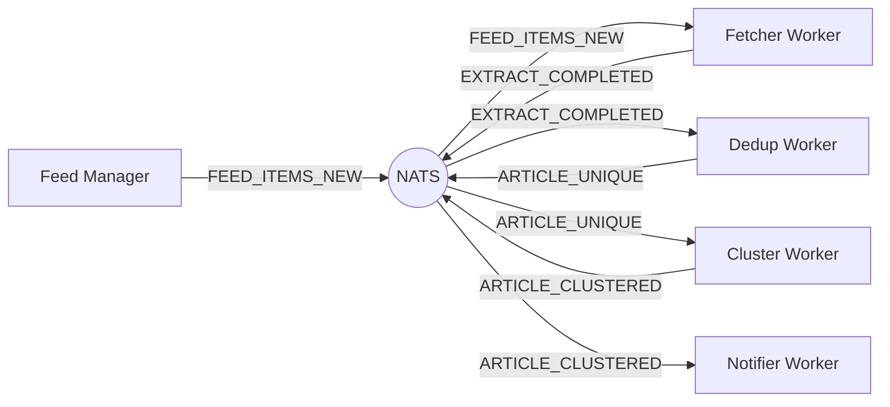
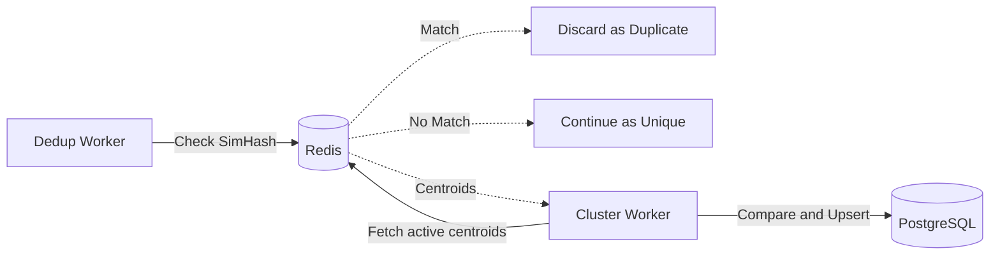
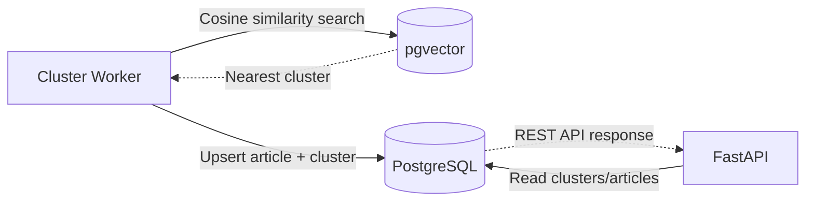
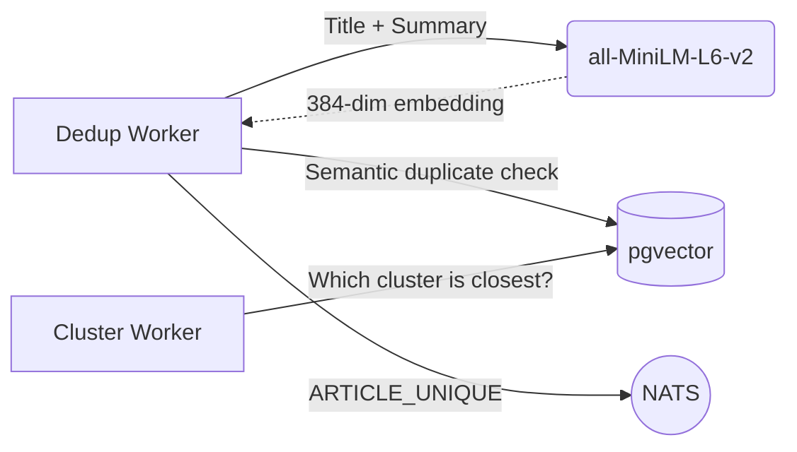
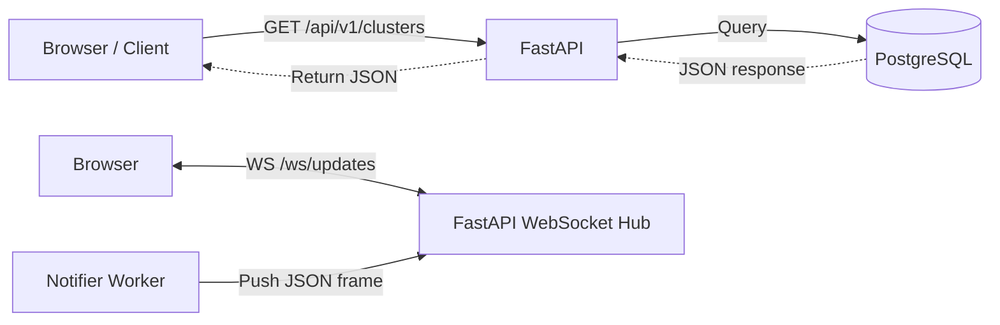
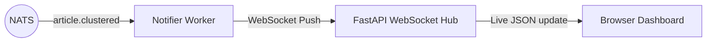
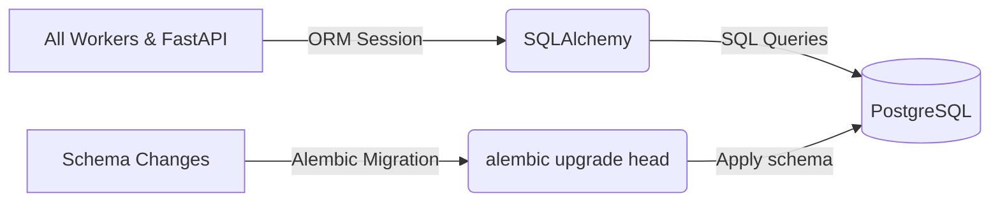

# Tech Stack Explained: How VyomaCast Works

This document explains every major technology used in VyomaCast. Each section answers five questions:
what it is, why it is used here, how it is integrated, how it works internally, and where it sits in the data flow.

---

## 1. NATS JetStream

### What it is
NATS is a lightweight, open-source messaging system written in Go. JetStream is the persistence layer built on top of NATS that adds durable, exactly-once message delivery. Think of it as a high-speed internal postal system for your microservices.

### Why it is used here
VyomaCast is split into several independent Python workers (Fetcher, Dedup, Cluster, Notifier). Without NATS, these services would have to call each other directly, meaning if one crashed, the chain would break. NATS decouples them: each worker only knows how to receive a message and send a reply. It has no idea who is listening.

### How it is integrated
Each worker subscribes to a specific NATS subject (like `article.unique` or `article.clustered`). When a worker finishes its job, it publishes a new message to the next subject. NATS handles delivery, retries, and durability automatically. If the Cluster Worker crashes mid-processing, NATS holds the unacknowledged message and redelivers it when the worker comes back online.

### How it works internally
NATS maintains a durable log of messages per subject (called a stream). Each worker has a consumer that checkpoints its position in the log. A message is only removed from the log once the worker sends an explicit ACK (acknowledgement). If a worker sends NAK, the message is requeued. If a message fails 5 times, it is sent to a Dead Letter Queue to prevent infinite loops.

### Where it appears in the data flow


---

## 2. Redis

### What it is
Redis (Remote Dictionary Server) is an in-memory key-value data store. It stores data directly in RAM, making read and write operations nearly instantaneous (typically under 1 millisecond).

### Why it is used here
Two problems arise when processing thousands of articles per hour: (1) checking every article for duplicates by querying PostgreSQL would be slow and would hammer the database, and (2) the Cluster Worker needs quick access to the active cluster centroids without fetching them from disk every time. Redis solves both by acting as a hot-state cache: a super-fast scratchpad sitting between the workers and the database.

### How it is integrated
**Deduplication (SimHash):** When the Dedup Worker processes an article, it computes a 128-bit SimHash fingerprint of the text. It then checks Redis for any fingerprint that is within a Hamming distance of 3 bits. If a match is found, the article is discarded as a duplicate. If not, the new fingerprint is stored in Redis with a TTL (time-to-live) so old fingerprints expire automatically.

**Cluster Cache:** The Cluster Worker stores the centroid vectors of the most recently active clusters in Redis. This means when a new article arrives, the worker looks up active clusters in RAM first before ever touching PostgreSQL.

### How it works internally
Redis stores data as key-value pairs entirely in memory. Its speed comes from the fact that RAM access is roughly 100,000 times faster than a disk read. For SimHash sliding windows, Redis uses Sorted Sets (ZSets), which allow range queries in O(log N) time. All data evicts automatically based on TTL so Redis never fills up with stale fingerprints.

### Where it appears in the data flow


---

## 3. PostgreSQL + pgvector

### What it is
PostgreSQL is the world's most advanced open-source relational database. pgvector is a PostgreSQL extension that adds a new column data type: the vector. This allows PostgreSQL to store high-dimensional floating-point arrays (like AI embeddings) and run similarity search queries against them natively using SQL.

### Why it is used here
Two distinct storage needs exist in this system: (1) structured relational data (articles have titles, timestamps, source URLs, and belong to clusters), and (2) vector data (each article has a 384-dimensional embedding that represents its semantic meaning). Using a dedicated vector database (like Pinecone) would create two separate systems that need to stay in sync. By using pgvector, both the relational data and the vector data live in the same database transaction. If the article saves, the vector saves too. This guarantees data consistency.

### How it is integrated
The articles table has standard id, title, published_at columns AND an `embedding vector(384)` column. When the Cluster Worker processes a new article, it performs a vector similarity query:

```sql
SELECT id, embedding FROM clusters
ORDER BY centroid <=> :new_embedding
LIMIT 5;
```

The `<=>` operator is the cosine distance function provided by pgvector. The result tells the worker which cluster is semantically closest to the incoming article. HNSW (Hierarchical Navigable Small World) indexing is applied to the embedding column, which reduces the search from O(N) brute-force to approximately O(log N).

### How it works internally
A vector embedding is a list of 384 floating-point numbers that represents the semantic position of a piece of text in a high-dimensional mathematical space. Two articles about the same topic will have vectors that are geometrically close to each other. PostgreSQL computes the angle between two vectors (cosine similarity) to determine how related they are. A similarity above 0.92 means they belong to the same story cluster.

### Where it appears in the data flow


---

## 4. sentence-transformers (all-MiniLM-L6-v2)

### What it is
sentence-transformers is an open-source Python library built on top of Hugging Face Transformers. all-MiniLM-L6-v2 is a specific pre-trained model that converts any piece of text into a 384-dimensional vector (embedding). This model runs entirely on the local CPU with no internet connection, no API keys, and no cost per call.

### Why it is used here
Pure keyword or lexical matching fails at detecting semantic similarity. "Scientists discover new planet" and "Astronomers find exoplanet orbiting distant star" share almost no identical words but mean the same thing. By converting each sentence to a mathematical vector, the model captures the meaning of the text rather than just the exact words used. Two similar articles will produce vectors that are geometrically close in 384-dimensional space.

### How it is integrated
When the Dedup Worker receives an article that passes the SimHash check (meaning it is not a lexical duplicate), it passes the article title and summary to the sentence-transformer model. The model returns a list of 384 floating-point numbers. That vector is then used to:

1. Run a cosine similarity check against vectors of recently stored articles in PostgreSQL to catch semantic duplicates.
2. Run a cosine similarity check against cluster centroids to find the correct cluster to assign the article to.

### How it works internally
The model was trained on hundreds of millions of sentence pairs to understand which sentences are semantically similar. Internally it uses a 6-layer BERT-like transformer architecture. Words in a sentence attend to each other, so the final 384-number output captures the relationships between all the words, not just their individual meanings. The output vector is normalized so that cosine distance (the angle between two vectors) becomes the correct measure of similarity.

### Where it appears in the data flow


---

## 5. FastAPI

### What it is
FastAPI is a modern Python web framework for building REST APIs. It is built on top of Starlette (ASGI) and Pydantic (data validation). It is the fastest Python web framework available and generates interactive API documentation (Swagger UI) automatically from your code.

### Why it is used here
The dashboard and any external clients need a way to query the state of the system: How many clusters exist? What articles are in cluster #5? FastAPI provides clean, validated REST endpoints for these read operations. It also hosts the WebSocket endpoint that the browser connects to for live updates.

### How it is integrated
The FastAPI application runs as an ASGI process via uvicorn. It has two distinct roles:

1. **REST Layer:** Exposes endpoints like `GET /api/v1/clusters` and `GET /api/v1/articles` that query PostgreSQL and return JSON.
2. **WebSocket Hub:** Exposes a `WS /ws/updates` endpoint. When the Notifier Worker receives an `article.clustered` event from NATS, it pushes a JSON frame to all connected WebSocket clients through this hub.

A 20-second server-side ping loop keeps all WebSocket connections alive indefinitely without requiring the browser to do anything.

### How it works internally
FastAPI uses Python async/await syntax throughout. When a browser connects via WebSocket, the connection is held open as a coroutine: it does not block other requests. When the Notifier Worker wants to broadcast a new cluster update, it iterates over all active WebSocket connections in the hub and sends the JSON payload to each one. Pydantic models validate every incoming and outgoing payload automatically, rejecting malformed data before it ever touches the database.

### Where it appears in the data flow


---

## 6. WebSocket Dashboard (Vanilla JS + CSS)

### What it is
The dashboard is a single HTML file served by Python's built-in http.server. It uses zero frontend frameworks: just vanilla JavaScript and CSS.

### Why it is used here
A traditional website polling `GET /api/clusters` every 5 seconds would create unnecessary server load and introduce up to 5 seconds of delay between an article being processed and the user seeing it. WebSockets maintain a persistent, full-duplex TCP connection so the server can push data to the browser the millisecond it is available.

### How it is integrated
On page load, the browser opens a WebSocket connection to `ws://localhost:8000/ws/updates`. The JavaScript receives JSON frames from the FastAPI hub and surgically updates the DOM: inserting, updating, or flash-animating cluster cards without refreshing the page. A connection-status indicator (green = Live, amber = Reconnecting, red = Offline) at the top shows the connection state at all times.

### How it works internally
WebSocket is a protocol upgrade from HTTP. The browser first sends a standard HTTP request with an `Upgrade: websocket` header. The server accepts, and from that point on, the TCP connection stays open. VyomaCast uses a server-to-client-only pattern: only the server pushes updates; the browser only listens and renders.

### Where it appears in the data flow


---

## 7. SQLAlchemy 2.0 + Alembic

### What it is
SQLAlchemy is Python's standard ORM (Object-Relational Mapper). Instead of writing raw SQL strings, you define Python classes and SQLAlchemy translates them to SQL. Alembic is the companion migration tool that manages changes to the database schema over time.

### Why it is used here
Using raw SQL strings in Python makes code fragile and hard to maintain. SQLAlchemy lets us write Pythonic code to interact with the database. Alembic ensures that when we add a new column or index (like the pgvector HNSW index), the schema change is applied safely and repeatably across any environment.

### How it is integrated
The Article and Cluster models are defined as SQLAlchemy ORM classes with their column types and relationships. When the Cluster Worker upserts data, it uses an SQLAlchemy session to run an atomic `INSERT ... ON CONFLICT DO UPDATE` with version-guarded optimistic concurrency control. The version column prevents race conditions when two workers try to update the same cluster simultaneously.

### Where it appears in the data flow


---

## 8. Docker Compose

### What it is
Docker Compose is a tool for defining and running multi-container applications. A single `docker-compose.yml` file declares all the infrastructure services (PostgreSQL, Redis, NATS) and spins them all up with one command.

### Why it is used here
Without Docker, every developer setting up this project would have to manually install PostgreSQL, Redis, and NATS on their machine, configure each one, and hope the versions match. Docker guarantees that every environment (local laptop, cloud server, CI pipeline) runs the exact same infrastructure with the exact same configuration every single time.

### How it is integrated
Running `docker compose up -d` starts three containers: a PostgreSQL 16 container with the pgvector extension pre-installed, a Redis 7 container, and a NATS server with JetStream enabled. The Python workers and FastAPI connect to these containers via standard host/port settings defined in the `.env` file.

### Where it appears in the data flow
Docker Compose is the foundation. It is not part of the data flow itself: it is the environment that makes the entire data flow possible.

---

## Summary Table

| Technology | Role | Key Characteristic |
|---|---|---|
| NATS JetStream | Event backbone between workers | Exactly-once delivery, durable logs |
| Redis | Hot-state cache, SimHash dedup | Sub-millisecond RAM access |
| PostgreSQL | Permanent relational storage | ACID-compliant, disk-persistent |
| pgvector | Semantic similarity search | O(log N) via HNSW index |
| sentence-transformers | Text to 384-dim vector embedding | Fully local, no API cost |
| FastAPI | REST API and WebSocket hub | Async, non-blocking, auto-docs |
| Vanilla JS Dashboard | Real-time browser UI | Zero-dependency, surgical DOM updates |
| SQLAlchemy + Alembic | ORM and schema migrations | Type-safe, version-controlled schema |
| Docker Compose | Infrastructure orchestration | One-command repeatable environment |
